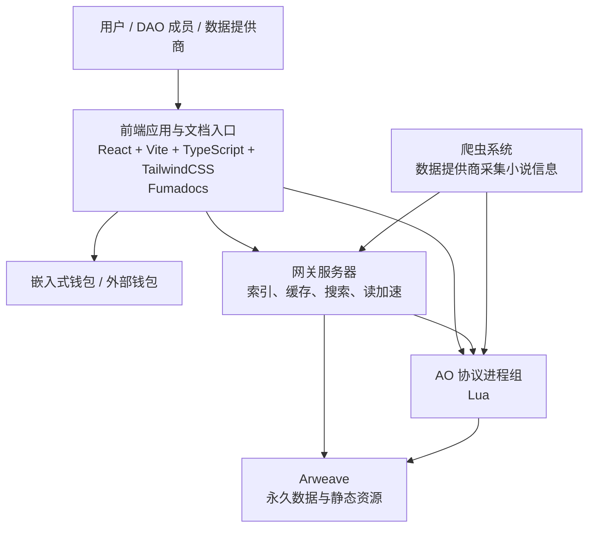

# 神农书库整体架构设计

本文基于《文档.md》整理神农书库的项目整体架构，只设计系统边界、主要分层、部署阶段和数据流向，不设计协议接口、数据库表结构、消息字段或具体实现细节。

## 架构目标

神农书库是一个去中心化且开源的小说评价平台。整体架构需要服务以下目标：

- 方便读者找书；
- 永久可用；
- 抗审查；
- 低成本运行；
- 项目失败或分叉后，用户数据和贡献记录仍可恢复；
- 任何人都可以运行替代网关、爬虫或前端；
- DAO 通过协议和任务系统治理项目资产、资金和贡献奖励。

## 核心原则

AO 协议是系统的权威状态层。

Arweave 是永久数据和静态资源的存储层。

网关是索引、缓存和访问加速层，不是权威后端。

前端是统一用户入口，包含产品功能入口和文档入口，可以被永久部署到 Arweave，也可以在测试阶段由网关服务器承载。

爬虫是数据提供商的采集工具，只提交来源平台事实和采集结果，不直接改变协议治理状态。

嵌入式钱包用于降低 Web2 用户进入门槛，外部钱包用于高级用户、长期资产管理和更强安全需求。

## 总体架构



## 代码组织方式

项目早期建议采用单一仓库管理，`apps`、`protocols`、`packages` 是同一个仓库内的目录，不是独立仓库。

```text
shennong/
  apps/
    web/
    gateway/
    crawler/
  protocols/
    ao/
  packages/
    sdk/
    types/
    config/
```

`apps/web` 同时承载产品界面和 Fumadocs 文档入口。即使后期因为构建工具或发布流程需要拆分构建产物，在整体架构中仍归属于前端层。

采用单一仓库的原因：

- 前端、协议、网关、爬虫和共享类型会频繁联动；
- 早期协议字段和产品流程变化较快；
- 统一测试、版本、发布和文档更容易；
- 减少跨仓库依赖和版本协调成本。

后期当协议稳定、贡献者增多、模块职责清晰后，可以再考虑拆分独立仓库。例如：

- AO 协议独立仓库；
- 网关独立仓库；
- 爬虫独立仓库；
- SDK 独立仓库。

拆仓库不应作为早期目标，而应作为治理、权限、发布和贡献规模增长后的结果。

## 前端层

前端使用 React、Vite、TypeScript 和 TailwindCSS。

前端负责统一用户体验，不保存权威状态。

项目文档使用 Fumadocs，但在架构上不作为独立系统入口，而是合并到前端层中。用户访问产品功能、治理入口、开发文档和协议说明时，都应从同一个前端入口进入。

主要职责：

- 项目文档入口；
- 小说检索；
- 标签筛选；
- 评分；
- 评论；
- 论坛；
- 书架；
- 黑名单；
- 书单；
- 标签提交和挑战入口；
- 数据纠错入口；
- DAO 治理入口；
- 任务和奖励入口；
- SNID / DID 身份入口；
- 嵌入式钱包；
- 外部钱包连接；
- 网关配置和切换。

文档模块的主要职责：

- 项目介绍；
- 用户指南；
- 协议规则；
- DAO 治理规则；
- 数据提供商规则；
- 开发文档；
- 网关运行说明；
- 爬虫运行说明；
- 安全与审计说明。

测试阶段，前端应用和 Fumadocs 文档模块都可以由网关服务器承载，方便快速修改和预览。

正式阶段，前端静态资源和文档内容应逐步存储到 Arweave，保证项目说明、协议规则、治理规则和开发文档可长期访问。

文档内容后期也应支持网关索引和搜索。

前端读取数据时，默认优先访问网关提供的索引接口，以获得较快响应。

前端提交会改变协议状态的操作时，应直接或通过可信提交层向 AO 协议发送消息。

前端必须允许用户查看关键操作对应的 AO 消息、Arweave 内容和协议状态来源。

## 钱包与身份层

平台身份使用 SNID，产品层可以继续称为 DID。

SNID 是平台内永久不变的身份主键，评论、评分、标签、投票、声誉和处罚记录绑定 SNID。

钱包是 SNID 当前控制者，可以更换。

代币、保证金、奖励、DEX 仓位和经济责任归属于钱包地址，不归属于 SNID。

钱包体系分为两类：

- 嵌入式钱包：降低 Web2 用户注册、登录、签名和日常操作门槛；
- 外部钱包：适合高级用户管理长期资产、治理权和高价值操作。

推荐使用方式：

```text
长期钱包：SNID Owner
嵌入式钱包：Delegate
```

这样普通评论、评分、打标签等日常操作可以使用嵌入式钱包完成，高风险操作仍由长期钱包确认。

## AO 协议层

AO 协议使用 Lua 编写并部署到 AO。

AO 协议是系统权威状态来源，负责身份、小说、标签、评分、论坛、任务、治理、代币、声誉、处罚和数据提供商规则。

协议应拆成一组协作进程，而不是一个巨型进程。

建议的协议分组：

- 身份协议：SNID 创建、用户名、资料、Delegate、身份迁移；
- 小说登记协议：BookID 分配、小说基础数据、热数据、平台书籍索引；
- 标签协议：标签定义、标签提交、质押、挑战、奖励；
- 评分协议：评分提交、评分权重、评分奖励；
- 评论与论坛协议：主题、回复、作者身份、内容引用、治理讨论；
- 任务协议：标准化任务、非标准化任务、验收、付款、声誉生成；
- 治理协议：DAO、提案、投票、预算、资金池、复决；
- 代币协议：发行、余额、手续费、质押、奖励和罚没；
- 声誉与处罚协议：声誉记录、风险继承、处罚、争议结果；
- 数据提供商协议：数据提供商资格、批次提交、任务周期、奖励和挑战。

DID Registry 只处理低频身份操作。

评论、评分、标签、投票和论坛等高频操作应由独立业务进程处理，不能全部写入 DID Registry。

## Arweave 存储层

Arweave 是永久存储层。

正式阶段应存储：

- 前端静态资源；
- 前端文档内容；
- 用户资料；
- 评论和论坛正文；
- 较大的小说描述和内容引用；
- 爬虫提交证据；
- AO 消息和协议事件；
- 可用于恢复系统状态的历史数据。

AO 协议中不应保存不必要的大文本。大内容优先写入 Arweave，协议状态中保存对应内容标识。

当前端、官方网关或特定运行者停止维护时，其他人仍应能通过 Arweave 数据恢复前端、文档、索引和协议历史。

## 网关层

网关提供数据索引服务，加速用户访问速度。

网关不是权威后端，不应拥有改变协议状态的特殊权限。

主要职责：

- 索引 AO 协议消息；
- 索引 Arweave 内容；
- 建立小说检索读模型；
- 建立标签筛选读模型；
- 建立评分排序读模型；
- 缓存文档、封面、资料和论坛内容；
- 为前端提供低延迟读取接口；
- 为爬虫提供当前协议状态基准；
- 提供网关健康状态和索引进度；
- 支持第三方运行者部署替代网关。

网关可以提升体验，但不能成为系统单点。

前端应提供网关配置能力，当官方网关不可用时，用户可以切换到第三方网关。

## 爬虫与数据提供商层

爬虫由数据提供商运行，用于采集小说平台信息。

爬虫主要职责：

- 扫描来源平台；
- 发现新增小说；
- 判断是否满足入库条件；
- 采集小说基础数据；
- 采集小说热数据；
- 检测字数、最新章节、连载状态和下架状态变化；
- 生成批次提交；
- 提交空增量批次；
- 提交故障报告；
- 接受挑战、纠错和任务验收。

数据提供商可以提交来源平台展示的基础数据和热数据。

数据提供商不能自行改变刷量确认、冻结、处罚和治理状态。

AO 协议只进行确定性的基本检查，例如提交者权限、字段格式、批次幂等性、BookID 是否存在和平台书籍 ID 是否重复。

复杂问题进入纠错、挑战或治理流程，例如：

- 同一本小说更换书籍 ID；
- 同一本小说更换链接；
- 同一本小说被拆分为多个页面；
- 同一本小说存在新旧版本页面；
- 同一本小说被不同账号重复发布；
- 不同平台转载或联合发布同一本小说；
- 来源平台数据异常；
- 数据提供商错误入库。

## 论坛层

论坛是社区讨论和治理协作层。

论坛不替代协议状态，也不直接决定奖励、处罚或治理结果。

主要场景：

- 小说讨论；
- 标签争议；
- 数据纠错；
- 刷量线索；
- DAO 提案讨论；
- 任务协作；
- 治理公告；
- 数据提供商沟通；
- 开发和文档协作。

论坛正文可以存储在 Arweave，AO 协议保存主题、回复、作者 SNID、内容引用、状态和治理关联关系。

网关负责论坛列表、搜索、排序、缓存和聚合。

## 部署阶段

### 测试阶段

测试阶段的重点是快速迭代和跑通闭环。

测试阶段部署方式：

```text
ARNS 域名
  ↓
网关服务器
  ↓
前端应用与文档模块 / 网关 API / 索引服务
  ↓
AO 测试协议 + Arweave
```

测试阶段需要将 ARNS 域名作为统一入口，并解析或转发到网关服务器承载的测试环境。

测试阶段网关服务器承载：

- 前端应用和 Fumadocs 文档模块；
- 网关 API；
- 索引服务；
- 测试环境配置；
- 必要的健康检查页面。

测试阶段需要优先验证：

- 嵌入式钱包创建和签名；
- SNID 创建和 Delegate；
- 代币基础发行与任务付款；
- 声誉生成；
- 开发 DAO、推广 DAO、内容 DAO 基础运行；
- 任务创建、验收与裁决；
- 网关索引；
- 前端文档入口访问；
- ARNS 测试入口；
- 测试网关服务器部署。

### 正式阶段

正式阶段的重点是永久可用和可恢复。

正式阶段部署方式：

```text
ARNS 域名
  ↓
Arweave 上的永久前端应用与文档模块
  ↓
可配置网关
  ↓
AO 协议 + Arweave 永久数据
```

正式阶段应实现：

- 前端静态资源和文档内容部署到 Arweave；
- ARNS 指向正式入口；
- 官方网关只作为默认网关；
- 前端支持第三方网关配置；
- 协议数据可被第三方重新索引；
- 爬虫和数据提供商可由不同运行者参与；
- DAO 通过任务和治理机制维护前端、文档、协议、网关和爬虫。

## 主要数据流

### 普通用户访问

```text
用户
  ↓
ARNS 入口
  ↓
前端
  ↓
网关读取索引数据
  ↓
AO / Arweave 校验权威来源
```

### 用户提交操作

```text
用户
  ↓
嵌入式钱包或外部钱包签名
  ↓
前端提交消息
  ↓
AO 协议处理
  ↓
Arweave 保存消息和相关内容
  ↓
网关索引最新状态
```

### 数据提供商采集

```text
数据提供商
  ↓
爬虫读取网关或 AO 当前状态
  ↓
扫描来源平台
  ↓
生成新增小说或增量更新批次
  ↓
提交 AO 协议
  ↓
协议记录结果
  ↓
网关索引批次和结果
```

### 前端与文档发布

```text
测试阶段：前端应用与文档模块 → 网关服务器 → ARNS 测试入口

正式阶段：前端静态资源与文档内容 → Arweave → ARNS 正式入口 → 网关索引搜索
```

## 权威性边界

前端可以展示和提交操作，但不是权威状态来源。

网关可以索引、缓存和聚合，但不能改变协议事实。

爬虫可以采集和提交来源平台事实，但不能直接决定治理状态。

AO 协议决定身份、资产、奖励、处罚、治理和任务结算状态。

Arweave 保证内容、消息和历史数据可长期访问。

DAO 通过治理协议和任务协议改变项目规则、资金流向和维护职责。

## 早期优先级

第一阶段应先完成最小可运行闭环：

- 前端应用和 Fumadocs 文档模块；
- 嵌入式钱包；
- SNID 创建；
- 代币；
- 声誉；
- DAO：开发、推广、内容 DAO；
- 任务与裁决；
- 网关索引；
- ARNS 测试入口；
- 测试网关服务器部署。

第二阶段再扩展：

- 小说入库；
- 标签；
- 爬虫批量提交；
- 论坛；
- 评分；
- 书架；
- 黑名单；
- 书单；
- DAO 治理；
- 复杂处罚和风险继承；
- 第三方网关切换；
- 多数据提供商协作。

第三阶段进入正式去中心化部署：

- 前端应用和文档模块部署到 Arweave；
- ARNS 正式入口；
- 多网关运行；
- 多爬虫运行；
- 协议和索引可恢复；
- DAO 长期维护机制。

## 暂不设计的内容

本文不展开以下细节：

- Lua 进程内部状态结构；
- 数据库表结构；
- 爬虫调度策略；
- 前端页面结构；
- ARNS 具体记录配置；
- 部署脚本；
- 安全审计规则。

第一阶段参数、AO 消息规格、共享类型、网关 API、嵌入式钱包方案、权限模型和最小测试计划已进入《第一阶段最小可运行闭环设计.md》。后续实现阶段仍需要补充 Lua 进程内部状态结构、数据库表结构、前端页面结构、ARNS 具体记录配置、部署脚本和安全审计规则。
