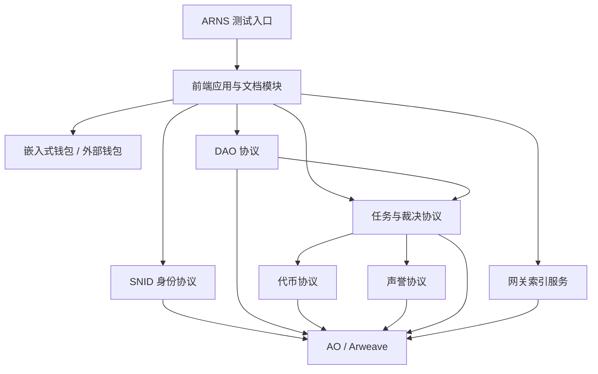

# 第一阶段最小可运行闭环设计

本文基于《文档.md》和《架构设计.md》编写，设计神农书库第一阶段的最小可运行闭环。第一阶段目标调整为：优先支持开发贡献、文档贡献、基础设施贡献和早期治理协作的记录、验收、裁决、代币发放与声誉生成。

第一阶段不再优先实现小说入库、标签、爬虫和评分。这些内容进入后续阶段。

## 目标与范围

第一阶段必须跑通以下闭环：

```text
贡献者访问 ARNS 测试入口
  ↓
前端应用加载
  ↓
贡献者创建或连接嵌入式钱包
  ↓
贡献者创建 SNID
  ↓
DAO 发布或登记任务
  ↓
贡献者领取任务并提交交付证据
  ↓
任务进入挑战期
  ↓
无挑战自动通过，或有挑战进入裁决
  ↓
任务模块完成 tSNLT 付款
  ↓
声誉模块按人类劳动时间生成对应 DAO 声誉
  ↓
网关索引身份、DAO、任务、裁决、付款和声誉
  ↓
前端展示任务状态、代币余额、声誉和贡献记录
```

第一阶段包含：

- 前端应用和 Fumadocs 文档模块；
- 嵌入式钱包；
- SNID 创建；
- 代币；
- 声誉；
- DAO：开发 DAO、推广 DAO、内容 DAO；
- 任务与裁决；
- 网关索引；
- ARNS 测试入口；
- 测试网关服务器部署。

为了满足“记录与发放开发贡献”，第一阶段还需要补充以下能力：

- DAO 注册与资金池；
- 开发任务模板；
- 交付证据记录；
- 代码仓库、提交、PR、Issue、部署记录等外部证据引用；
- 任务预算锁定；
- 劳动报酬与其他开销补贴分账；
- 挑战期参数；
- 裁决者配置；
- 恶意所得剔除记录；
- `tSNLT` 转正式 `SNLT` 的资格记录；
- 网关对任务、付款、声誉和裁决的索引。

第一阶段不包含：

- 小说入库；
- 标签；
- 爬虫批量提交；
- 评分；
- 论坛；
- 书架；
- 黑名单；
- 书单；
- 完整 DAO 治理；
- 正式成员资格和专业票权；
- 复杂处罚和风险继承；
- DEX 和流动性机制；
- 第三方网关切换的完整产品化体验。

第一阶段涉及的模块应尽量完整实现本阶段所需能力。后续可以扩展规则和参数，但不应推翻第一阶段已经产生的身份、任务、付款、声誉和裁决记录。

## 设计原则

### 协议优先

第一阶段产生的关键状态必须以 AO 协议为权威来源。

前端可以展示状态，网关可以索引状态，测试网关服务器可以承载入口，但它们都不是最终事实来源。

### 开发贡献优先

第一阶段优先解决项目早期最现实的问题：如何记录开发者、文档维护者、部署维护者、审查者和裁决者的贡献，并按规则发放代币和声誉。

小说内容侧功能可以后移，但开发贡献的身份、任务、付款和声誉必须先闭环。

### 代币与声誉分账

代币和声誉都以“1分钟人类劳动时间”为基本单位，但用途不同。

代币：

- 1 个代币对应 1 分钟人类劳动时间；
- 可以作为劳动报酬；
- 也可以按规则换算并补贴服务器、域名、网关、代理、审计、工具等其他开销；
- 测试阶段使用 `tSNLT`；
- 测试期合法获得的 `tSNLT` 后续按 1:1 转换为正式 `SNLT`；
- 测试期间恶意所得的 `tSNLT` 会被剔除。

声誉：

- 1 分钟人类劳动时间对应 1 点声誉；
- 只记录已经确认的人类劳动贡献；
- 不用于补偿服务器、域名、工具、代理、第三方采购等货币开销；
- 不可转让、不可出售、不可委托；
- 不随代币转账而转移；
- 问题任务被撤销时，对应声誉可以撤销。

### 任务统一发放

所有面向个人的钱包付款都必须经过任务模块。

DAO 不应绕过任务模块直接向个人地址支付劳动报酬、奖励、裁决报酬或报销。

### 启动期不设特殊任务类型

启动期任务不需要额外设计特殊启动任务类型。

第一阶段可以通过参数实现启动期便利：

- 挑战期设置为几秒；
- 启动期任务不要求质押；
- 裁决者使用测试配置；
- 后续通过治理延长挑战期、增加质押和调整资格。

启动期任务仍然使用普通任务、验收、挑战、裁决、付款和声誉记录流程。

### 可迁移

第一阶段虽然在测试网关服务器运行，但必须为正式阶段迁移保留数据连续性：

- SNID 不能因为迁移而改变；
- 任务记录应可追溯；
- 付款记录应可追溯；
- 转账记录应可追溯；
- 声誉记录应可追溯；
- 恶意所得剔除应可追溯；
- 合法 `tSNLT` 到正式 `SNLT` 的转换资格应可计算。

## 既有规则与待确认参数

本文复用主文档中已经明确的规则：

- SNID 使用 `snid:<16位Base64URL字符>` 作为展示格式；
- SNID 由共享 `DIDRegistry Process` 管理；
- 测试阶段代币符号使用 `tSNLT`；
- 代币对应 1 分钟人类劳动时间；
- 声誉对应 1 分钟人类劳动时间；
- 声誉只记录人类劳动贡献；
- 所有个人代币发放必须通过任务模块执行；
- 任务付款必须区分劳动报酬、开销补贴、成本报销、保证金返还和其他款项；
- 声誉不可转让、不可出售、不可委托，不随代币转账而转移；
- 任务被认定无效、虚假、恶意或重复时，可以撤销对应代币转换资格和声誉。

第一阶段默认配置草案如下。

这些参数进入 `packages/config`、协议初始化参数或 DAO 参数，不应散落在业务逻辑中。实现时允许按环境覆盖，但覆盖值必须进入配置版本记录，并由网关展示当前生效版本。

| 参数 | 默认值 | 落点 | 说明 |
| --- | --- | --- | --- |
| 测试代币符号 | `tSNLT` | `token.symbol` | 第一阶段唯一测试代币符号。 |
| 测试代币精度 | `12` | `token.decimals` | 1 `tSNLT` 等于 `1000000000000` 最小单位；劳动换算仍为 1 分钟对应 1 `tSNLT`。 |
| 测试代币转正式代币规则 | 合法任务所得 1:1 转换 | `token.conversionPolicy` | 争议中、恶意、虚假、重复、撤销所得不转换。 |
| 用户间自由转账 | 第一阶段开启 | `token.walletTransferEnabled` | 支持钱包之间自由转账，转账必须保留来源批次和转换资格状态。 |
| DAO 初始化资金池 | `0 tSNLT` | `dao.pools.*.initialAmount` | 开发 DAO、推广 DAO、内容 DAO 创建时均不预置资金。 |
| DAO 每日增发规则 | 按 DAO 配置项每日增发 | `dao.pools.*.dailyIssuanceAmount` | 每个 DAO 的每日增发额度必须通过配置或 DAO 参数确认，不能写死在业务逻辑中。 |
| 每日增发结算日 | 北京时间自然日 | `dao.pools.*.issuanceDayBoundary` | 同一 DAO、同一自然日只能增发一次，允许任意人触发幂等结算。 |
| ARNS 测试入口目标名 | `shennong-test` | `gateway.arnsTestName` | 作为第一阶段测试入口目标名；部署验收必须记录实际解析结果。 |
| 测试网关默认路径 | `/`、`/docs`、`/api/v1`、`/healthz` | `gateway.routes` | 前端、文档、网关 API 和健康检查共用同一入口。 |
| 嵌入式钱包方案 | 自实现测试钱包 | `wallet.embeddedProvider` | 浏览器本地生成 Arweave JWK，使用 Web Crypto 加密存储，不托管密钥。 |
| 外部钱包兼容边界 | Arweave 钱包适配器接口 | `wallet.externalAdapter` | 第一阶段只要求连接、地址读取和 AO 消息签名，不承诺高级资产管理能力。 |
| 启动期任务挑战期 | `10` 秒 | `task.defaultChallengePeriodSeconds` | 用于第一阶段快速闭环；端到端测试可覆盖为更短值。 |
| 启动期是否免质押 | `true` | `task.stakeRequired` | 第一阶段发起挑战和领取任务均不要求质押。 |
| 默认质押金额 | `0 tSNLT` | `task.defaultStakeAmount` | 后续治理可启用并调高。 |
| 裁决者测试资格 | SNID 白名单 | `task.adjudicatorAllowlist` | 必须是已创建 SNID，且不能是任务创建者、执行者或挑战者。 |
| 单次裁决奖励 | `30 tSNLT` | `task.adjudicationRewardMinutes` | 作为裁决劳动报酬，裁决任务通过后生成裁决类声誉。 |
| 有效挑战奖励 | `15 tSNLT` | `task.validChallengeRewardMinutes` | 只有挑战被裁决支持时发放，不因恶意挑战发放。 |
| 任务模板创建者 | DAO 操作员白名单 | `task.templateManagers` | 第一阶段不开放任意用户创建模板。 |
| 网关索引刷新间隔 | `5000` 毫秒 | `gateway.indexRefreshMs` | 轮询 AO 消息和 Arweave 内容的默认间隔。 |
| 网关分页默认大小 | `20` | `gateway.pagination.defaultLimit` | 所有列表接口默认分页大小。 |
| 网关分页最大大小 | `100` | `gateway.pagination.maxLimit` | 防止单次查询过大。 |
| 索引检查点间隔 | 每 `100` 个事件或 `10` 秒 | `gateway.checkpointPolicy` | 先满足任一条件即持久化游标。 |
| 测试数据保留策略 | 协议事件长期保留，网关索引可重建 | `data.retentionPolicy` | AO 与 Arweave 记录作为转换和申诉依据；网关本地索引不是权威数据。 |
| 网关日志保留期 | `14` 天 | `data.gatewayLogRetentionDays` | 只保留排障日志，不保存钱包密钥。 |
| 索引快照保留期 | `30` 天 | `data.indexSnapshotRetentionDays` | 用于加速恢复，快照缺失时必须能从协议事件重建。 |
| 测试配置修改权限 | 配置管理员白名单 | `config.admins` | 修改会影响经济参数时必须写入 DAO Process 事件。 |

## 模块总览



第一阶段模块关系：

- 前端是统一入口；
- 钱包负责签名、接收付款和发起转账；
- SNID 协议负责身份创建和授权验证；
- DAO 协议负责开发 DAO、推广 DAO、内容 DAO 的注册、资金池和任务归属；
- 任务与裁决协议负责任务创建、领取、提交、挑战、裁决、通过、拒绝、撤销；
- 代币协议负责 `tSNLT` 测试币、余额、资金池、预算锁定、付款、转账和转换资格；
- 声誉协议负责按 DAO 记录不可转让声誉；
- 网关负责索引身份、DAO、任务、裁决、付款、声誉和测试环境状态；
- 测试网关服务器负责承载测试入口、前端、文档、网关 API 和索引进程。

## 代码组织

第一阶段仍采用单一仓库。

```text
shennong/
  apps/
    web/
    gateway/
  protocols/
    ao/
  packages/
    sdk/
    types/
    config/
```

`apps/web` 同时承载产品界面和 Fumadocs 文档入口。

`apps/gateway` 承载索引服务、查询接口和测试环境健康检查。

`protocols/ao` 承载第一阶段需要部署的 AO Lua 协议进程，包括身份、DAO、代币、声誉、任务与裁决。

`packages/sdk` 封装前端和网关共用的 AO 调用能力。

`packages/types` 保存共享类型定义。

`packages/config` 保存测试环境、协议进程、网关地址、ARNS 入口和任务参数配置。

## AO 协议接口与消息规格

### 通用消息约定

第一阶段 AO 协议由 `DIDRegistry`、`DAO`、`Token`、`Task`、`Reputation` 五类 Process 组成。所有会改变状态的操作必须通过 AO 消息完成，网关只能索引和查询，不能代替协议作出权威判断。

写入消息使用统一标签。标签名和 `Action` 值遵循 AO 生态常见风格：使用英文连字符命名，例如 `Credit-Notice`、`Transfer-Error`、`Create-Task`；共享 TypeScript 类型字段仍使用 lowerCamelCase。

| 标签 | 含义 |
| --- | --- |
| `Protocol` | 固定为 `ShenNongPhase1`。 |
| `Version` | 第一阶段固定为 `1`。 |
| `Action` | 消息类型，例如 `Create-SNID`、`Create-Task`。 |
| `Request-Id` | 客户端生成的幂等键，同一签名钱包、同一 `Action`、同一 `Request-Id` 必须返回同一结果。 |
| `Actor-Wallet` | 当前签名钱包地址。 |
| `Actor-SNID` | 代表执行该操作的 SNID；创建 SNID 前允许为空。 |

简单输入字段优先放在 AO tags 中，复杂对象和数组可以放入 JSON 消息体。所有代币金额字段使用最小单位整数，并以字符串保存；1 `tSNLT` 等于 `1000000000000` 最小单位。劳动时间和声誉字段仍使用整数分钟，时间字段使用毫秒时间戳；前端和文档展示时统一转换为北京时间。

所有输出事件至少包含：

| 字段 | 含义 |
| --- | --- |
| `Action` | 事件名，例如 `Task-Created`。 |
| `Version` | 事件版本，第一阶段固定为 `1`。 |
| `Request-Id` | 对应写入消息的 `Request-Id`。 |
| `Process-Id` | 产生事件的 AO Process。 |
| `Entity-Id` | 主要实体标识，例如 `taskId`、`daoId`、`snid`。 |
| `Sequence` | Process 内单调递增序号。 |
| `Timestamp` | 协议记录的毫秒时间戳。 |

查询消息可以通过 SDK 对 AO 进行只读调用，也可以读取网关索引。查询消息不得改变协议状态。

### 通用错误码

错误响应的 `Action` 使用 `<原 Action>-Error` 或通用 `Protocol-Error`，错误码放入 `Error-Code` 标签或 JSON body 的 `errorCode` 字段。错误码本身保留全大写下划线格式，便于代码分支处理。

| 错误码 | 触发条件 |
| --- | --- |
| `INVALID_MESSAGE` | 消息体不是合法 JSON，或标签不完整。 |
| `MISSING_FIELD` | 必填字段缺失。 |
| `INVALID_FIELD` | 字段格式、枚举值或数值范围非法。 |
| `UNAUTHORIZED` | 签名钱包没有对应权限。 |
| `NOT_FOUND` | 目标 SNID、DAO、任务、付款或声誉记录不存在。 |
| `ALREADY_EXISTS` | 目标实体已存在。 |
| `DUPLICATE_REQUEST` | 幂等键冲突且消息体不一致。 |
| `INVALID_STATE` | 当前实体状态不允许执行该操作。 |
| `INSUFFICIENT_FUNDS` | DAO 资金池余额不足。 |
| `BUDGET_LOCKED` | 预算已锁定，不能重复锁定或挪用。 |
| `EVIDENCE_REQUIRED` | 任务提交、挑战或裁决缺少证据引用。 |
| `CHALLENGE_PERIOD_OPEN` | 挑战期尚未结束，不能自动通过。 |
| `CHALLENGE_PERIOD_CLOSED` | 挑战期已结束，不能再发起挑战。 |
| `SELF_ADJUDICATION_FORBIDDEN` | 裁决者是任务创建者、执行者或挑战者。 |
| `CONFIG_LOCKED` | 参数只能通过 DAO 配置事件修改，不能由普通消息修改。 |

### DIDRegistry Process

| 消息类型 | 权限 | 输入字段 | 输出事件 | 主要错误 |
| --- | --- | --- | --- | --- |
| `Create-SNID` | 任意未绑定 SNID 的签名钱包 | `ownerWallet`、`delegates`、`metadataUri` | `SNID-Created` | `ALREADY_EXISTS`、`INVALID_FIELD` |
| `Add-Delegate` | SNID owner | `snid`、`delegateWallet`、`capabilities`、`expiresAtMs` | `Delegate-Added` | `UNAUTHORIZED`、`NOT_FOUND` |
| `Remove-Delegate` | SNID owner | `snid`、`delegateWallet` | `Delegate-Removed` | `UNAUTHORIZED`、`NOT_FOUND` |
| `Resolve-SNID` | 只读 | `snid` | 返回 `SNID` | `NOT_FOUND` |
| `List-Wallet-SNIDs` | 只读 | `walletAddress` | 返回 `SNID[]` | `INVALID_FIELD` |

权限边界：

- `Create-SNID` 只能由当前签名钱包为自己创建 owner 关系；
- Delegate 只能代表 SNID 执行其 `capabilities` 明确允许的操作；
- 第一阶段不实现 SNID owner 迁移和恢复流程。

### DAO Process

| 消息类型 | 权限 | 输入字段 | 输出事件 | 主要错误 |
| --- | --- | --- | --- | --- |
| `Init-DAO` | 协议部署者 | `daoId`、`kind`、`name`、`treasuryPolicy`、`operators` | `DAO-Initialized` | `ALREADY_EXISTS`、`UNAUTHORIZED` |
| `Grant-Role` | 配置管理员或 DAO 操作员 | `daoId`、`snid`、`role` | `Role-Granted` | `UNAUTHORIZED`、`NOT_FOUND` |
| `Revoke-Role` | 配置管理员或 DAO 操作员 | `daoId`、`snid`、`role` | `Role-Revoked` | `UNAUTHORIZED`、`NOT_FOUND` |
| `Create-Task-Template` | 任务模板管理员 | `daoId`、`template` | `Task-Template-Created` | `UNAUTHORIZED`、`INVALID_FIELD` |
| `Update-Task-Template` | 任务模板管理员 | `daoId`、`templateId`、`patch` | `Task-Template-Updated` | `UNAUTHORIZED`、`NOT_FOUND` |
| `Update-Phase1-Config` | 配置管理员 | `daoId`、`configPatch`、`reason` | `Phase1-Config-Updated` | `CONFIG_LOCKED`、`UNAUTHORIZED` |
| `DAO-Info` | 只读 | `daoId` | 返回 `DAO` | `NOT_FOUND` |
| `List-DAOs` | 只读 | 无 | 返回 `DAO[]` | 无 |

权限边界：

- DAO Process 负责角色、任务模板和经济参数配置；
- `treasuryPolicy.initialAmount` 必须为 `0`，每日增发额度通过 `treasuryPolicy.dailyIssuanceAmount` 配置；
- DAO Process 不直接向个人付款，个人付款只能由 Task Process 触发 Token Process；
- 第一阶段只有开发 DAO、推广 DAO、内容 DAO 三个 DAO 可以初始化。

### Token Process

| 消息类型 | 权限 | 输入字段 | 输出事件 | 主要错误 |
| --- | --- | --- | --- | --- |
| `Mint-Daily-To-Pool` | 任意钱包触发，Token Process 按 DAO 配置校验 | `daoId`、`issuanceDate` | `Daily-Pool-Minted` | `INVALID_STATE`、`NOT_FOUND` |
| `Lock-Budget` | Task Process | `taskId`、`daoId`、`amount`、`paymentPlan` | `Budget-Locked` | `INSUFFICIENT_FUNDS`、`BUDGET_LOCKED` |
| `Release-Budget` | Task Process | `taskId`、`daoId`、`amount`、`reason` | `Budget-Released` | `UNAUTHORIZED`、`INVALID_STATE` |
| `Pay-Task` | Task Process | `taskId`、`daoId`、`payments` | `Task-Paid`、`Balance-Changed` | `UNAUTHORIZED`、`INVALID_STATE` |
| `Transfer` | 钱包余额持有人 | `Recipient`、`Quantity`、`Memo` | `Debit-Notice`、`Credit-Notice`、`Balance-Changed`、`Conversion-Lot-Moved` | `INSUFFICIENT_FUNDS`、`INVALID_FIELD` |
| `Mark-Conversion-Status` | Task Process | `lotIds`、`status`、`disputeId`、`reason` | `Conversion-Status-Changed` | `UNAUTHORIZED`、`NOT_FOUND` |
| `Balance` | 只读 | `walletAddress` | 返回余额 | `INVALID_FIELD` |
| `Conversion-Eligibility` | 只读 | `walletAddress` | 返回 `ConversionEligibility` | `INVALID_FIELD` |

权限边界：

- `tSNLT` 首次进入个人钱包只能来自 DAO 资金池通过任务付款；
- 第一阶段支持用户钱包之间使用 `Transfer` 自由转账；
- 转账必须按来源批次移动余额，批次的 `convertible`、`disputed`、`non_convertible` 状态随余额一起移动；
- DAO 资金池初始化金额必须为 `0`，资金来源为每日增发事件；
- 每个 DAO、每个北京时间自然日只能成功执行一次 `Mint-Daily-To-Pool`；
- 只有任务裁决或复查结果可以把付款标记为不可转换。

### Task Process

| 消息类型 | 权限 | 输入字段 | 输出事件 | 主要错误 |
| --- | --- | --- | --- | --- |
| `Create-Task` | DAO 任务创建者 | `daoId`、`templateId`、`taskType`、`title`、`goal`、`scope`、`outOfScope`、`deliverables`、`estimateMinutes`、`paymentPlan`、`challengePeriodSeconds`、`stakeRequired` | `Task-Created`、`Budget-Lock-Requested` | `UNAUTHORIZED`、`INVALID_FIELD`、`INSUFFICIENT_FUNDS` |
| `Claim-Task` | 有 SNID 的贡献者 | `taskId`、`assigneeSNID`、`assigneeWallet` | `Task-Claimed` | `INVALID_STATE`、`UNAUTHORIZED` |
| `Submit-Evidence` | 任务执行者 | `taskId`、`evidence` | `Task-Submitted` | `EVIDENCE_REQUIRED`、`INVALID_STATE` |
| `Open-Challenge` | 有 SNID 的非任务执行者 | `taskId`、`reason`、`evidence` | `Challenge-Opened` | `CHALLENGE_PERIOD_CLOSED`、`SELF_ADJUDICATION_FORBIDDEN` |
| `Submit-Ruling` | 测试裁决者 | `taskId`、`disputeId`、`ruling`、`reason`、`evidence` | `Ruling-Submitted` | `UNAUTHORIZED`、`SELF_ADJUDICATION_FORBIDDEN` |
| `Finalize-Task` | 任意钱包触发 | `taskId` | `Task-Approved`、`Task-Rejected`、`Task-Revoked`、`Payment-Requested`、`Reputation-Grant-Requested` | `CHALLENGE_PERIOD_OPEN`、`INVALID_STATE` |
| `Cancel-Task` | DAO 操作员，且任务未领取 | `taskId`、`reason` | `Task-Cancelled`、`Budget-Release-Requested` | `INVALID_STATE`、`UNAUTHORIZED` |
| `Reopen-Review` | DAO 操作员或测试裁决者 | `taskId`、`reason`、`evidence` | `Review-Reopened` | `UNAUTHORIZED`、`INVALID_STATE` |

权限边界：

- 任务创建必须引用 DAO 和任务模板；
- 任务付款、声誉生成、不可转换标记都由任务状态机触发；
- 没有挑战的任务只能在挑战期结束后通过 `Finalize-Task` 自动通过；
- 有挑战的任务必须经过裁决结果后才能结算；
- 任务执行者、任务创建者和挑战者不能裁决同一任务。

### Reputation Process

| 消息类型 | 权限 | 输入字段 | 输出事件 | 主要错误 |
| --- | --- | --- | --- | --- |
| `Grant-Reputation` | Task Process | `taskId`、`daoId`、`snid`、`kind`、`minutes`、`sourcePaymentIds` | `Reputation-Granted` | `UNAUTHORIZED`、`INVALID_FIELD` |
| `Revoke-Reputation` | Task Process | `recordIds`、`taskId`、`disputeId`、`reason` | `Reputation-Revoked` | `UNAUTHORIZED`、`NOT_FOUND` |
| `Reputation-Summary` | 只读 | `snid`、`daoId` | 返回声誉摘要 | `NOT_FOUND` |
| `List-Reputation-Records` | 只读 | `snid`、`daoId`、`cursor`、`limit` | 返回 `ReputationRecord[]` | `INVALID_FIELD` |

权限边界：

- 只有人类劳动报酬可以生成声誉；
- 开销补贴、成本报销、保证金返还、赔偿和其他非劳动付款不生成声誉；
- 声誉撤销必须保留原任务、裁决或复查引用。

## 共享数据结构

`packages/types` 至少需要导出以下第一阶段共享类型。字段名称使用英文标识符，说明和文档使用中文。协议状态、SDK 参数、网关读模型应优先复用这些类型，避免各应用重复定义。

```ts
type WalletAddress = string;
type ProcessId = string;
type UnixTimeMs = number;
type TokenAmount = string;

type SNID = {
  id: string;
  ownerWallet: WalletAddress;
  delegates: Delegate[];
  status: "active" | "revoked";
  createdAtMs: UnixTimeMs;
  updatedAtMs: UnixTimeMs;
};

type Delegate = {
  wallet: WalletAddress;
  capabilities: string[];
  expiresAtMs?: UnixTimeMs;
};

type DAO = {
  id: string;
  kind: "development" | "promotion" | "content";
  name: string;
  processId: ProcessId;
  treasury: DAOTreasury;
  roles: DAORoleAssignment[];
  configVersion: number;
  status: "active" | "paused";
};

type DAOTreasury = {
  tokenSymbol: "tSNLT";
  availableAmount: TokenAmount;
  lockedAmount: TokenAmount;
  totalIssuedAmount: TokenAmount;
  dailyIssuanceAmount: TokenAmount;
  lastIssuedDate?: string;
};

type DAORoleAssignment = {
  snid: string;
  role:
    | "config_admin"
    | "dao_operator"
    | "task_creator"
    | "template_manager"
    | "test_adjudicator";
  grantedAtMs: UnixTimeMs;
  revokedAtMs?: UnixTimeMs;
};

type TaskType =
  | "development"
  | "documentation"
  | "deployment"
  | "code_review"
  | "testing"
  | "promotion"
  | "content_rule"
  | "adjudication";

type TaskStatus =
  | "created"
  | "claimed"
  | "submitted"
  | "challenge_period"
  | "challenged"
  | "adjudicating"
  | "approved"
  | "rejected"
  | "paid"
  | "revoked"
  | "cancelled";

type Task = {
  id: string;
  daoId: string;
  templateId: string;
  type: TaskType;
  title: string;
  goal: string;
  scope: string;
  outOfScope: string;
  deliverables: string[];
  estimateMinutes: number;
  paymentPlan: PaymentPlan;
  budget: TaskBudget;
  creatorSNID: string;
  assigneeSNID?: string;
  assigneeWallet?: WalletAddress;
  evidence: Evidence[];
  status: TaskStatus;
  challengePeriodSeconds: number;
  challengeDeadlineMs?: UnixTimeMs;
  stakeRequired: boolean;
  disputeId?: string;
  payments: Payment[];
  reputationRecords: ReputationRecord[];
  createdAtMs: UnixTimeMs;
  updatedAtMs: UnixTimeMs;
};

type Evidence = {
  id: string;
  kind:
    | "git_commit"
    | "pull_request"
    | "issue"
    | "review"
    | "document"
    | "deployment_log"
    | "test_report"
    | "screenshot"
    | "recording"
    | "arweave"
    | "other";
  uri: string;
  contentHash?: string;
  title: string;
  submittedBySNID: string;
  submittedAtMs: UnixTimeMs;
};

type PaymentCategory =
  | "labor"
  | "server_cost"
  | "domain_cost"
  | "gateway_cost"
  | "tool_cost"
  | "third_party_purchase"
  | "deposit_return"
  | "compensation"
  | "other";

type PaymentPlan = {
  items: PaymentPlanItem[];
};

type PaymentPlanItem = {
  category: PaymentCategory;
  recipientSNID?: string;
  recipientWallet?: WalletAddress;
  amount: TokenAmount;
  generatesReputation: boolean;
};

type TaskBudget = {
  totalAmount: TokenAmount;
  lockedAmount: TokenAmount;
  releasedAmount: TokenAmount;
};

type Payment = {
  id: string;
  taskId: string;
  daoId: string;
  recipientWallet: WalletAddress;
  recipientSNID?: string;
  category: PaymentCategory;
  amount: TokenAmount;
  conversionStatus: "convertible" | "disputed" | "non_convertible";
  lotIds: string[];
  paidAtMs: UnixTimeMs;
};

type TokenLot = {
  id: string;
  ownerWallet: WalletAddress;
  sourcePaymentId: string;
  sourceTaskId: string;
  amount: TokenAmount;
  conversionStatus: "convertible" | "disputed" | "non_convertible";
  createdAtMs: UnixTimeMs;
  updatedAtMs: UnixTimeMs;
};

type TokenTransfer = {
  id: string;
  fromWallet: WalletAddress;
  toWallet: WalletAddress;
  amount: TokenAmount;
  lotMovements: TokenLotMovement[];
  memo?: string;
  createdAtMs: UnixTimeMs;
};

type TokenLotMovement = {
  lotId: string;
  sourcePaymentId: string;
  amount: TokenAmount;
  conversionStatus: "convertible" | "disputed" | "non_convertible";
};

type ReputationRecord = {
  id: string;
  daoId: string;
  snid: string;
  taskId: string;
  kind:
    | "development"
    | "documentation"
    | "deployment"
    | "review"
    | "testing"
    | "promotion"
    | "content_rule"
    | "adjudication";
  minutes: number;
  status: "active" | "revoked";
  sourcePaymentIds: string[];
  createdAtMs: UnixTimeMs;
  revokedAtMs?: UnixTimeMs;
  revokedByDisputeId?: string;
};

type Dispute = {
  id: string;
  taskId: string;
  challengerSNID: string;
  challengerWallet: WalletAddress;
  reason: string;
  evidence: Evidence[];
  status: "open" | "adjudicating" | "upheld" | "rejected" | "cancelled";
  adjudicatorSNIDs: string[];
  ruling?: DisputeRuling;
  openedAtMs: UnixTimeMs;
  resolvedAtMs?: UnixTimeMs;
};

type DisputeRuling = {
  result: "approve_task" | "reject_task" | "revoke_task";
  reason: string;
  evidence: Evidence[];
  maliciousIncome: boolean;
};

type ConversionEligibility = {
  walletAddress: WalletAddress;
  tokenSymbol: "tSNLT";
  totalAmount: TokenAmount;
  convertibleAmount: TokenAmount;
  disputedAmount: TokenAmount;
  nonConvertibleAmount: TokenAmount;
  items: ConversionEligibilityItem[];
  updatedAtMs: UnixTimeMs;
};

type ConversionEligibilityItem = {
  lotId: string;
  sourcePaymentId: string;
  sourceTaskId: string;
  amount: TokenAmount;
  status: "convertible" | "disputed" | "non_convertible";
  reason?: string;
  disputeId?: string;
};

type IndexState = {
  status: "syncing" | "healthy" | "degraded" | "rebuilding" | "down";
  processes: ProcessIndexState[];
  lastCheckpointAtMs?: UnixTimeMs;
  lastIndexedEventId?: string;
  lagMs?: number;
  rebuildReason?: string;
};

type ProcessIndexState = {
  processId: ProcessId;
  processKind: "did_registry" | "dao" | "token" | "task" | "reputation";
  cursor?: string;
  lastSequence?: number;
  lastIndexedAtMs?: UnixTimeMs;
};
```

## 前端应用和 Fumadocs 文档模块设计

### 定位

前端是第一阶段的统一入口。贡献者不需要区分产品应用和文档系统，所有入口都从同一个前端进入。

Fumadocs 文档模块是前端的一部分，用于承载项目介绍、贡献指南、任务规则、DAO 规则、代币与声誉说明、测试环境说明。

### 第一阶段职责

前端应用负责：

- 加载测试环境配置；
- 展示当前连接的钱包状态；
- 引导用户创建 SNID；
- 展示开发 DAO、推广 DAO、内容 DAO；
- 展示 DAO 资金池；
- 展示任务列表；
- 展示任务详情；
- 提供任务创建入口；
- 提供任务领取入口；
- 提供任务交付证据提交入口；
- 提供挑战入口；
- 提供裁决入口；
- 展示 `tSNLT` 余额；
- 提供 `tSNLT` 转账入口；
- 展示 `tSNLT` 转正式 `SNLT` 的当前资格状态；
- 展示声誉摘要；
- 展示付款记录；
- 展示转账记录；
- 展示网关索引状态；
- 提供文档入口；
- 展示测试环境健康状态。

文档模块负责：

- 说明第一阶段功能范围；
- 说明如何创建钱包和 SNID；
- 说明开发 DAO、推广 DAO、内容 DAO 的职责；
- 说明任务创建、领取、提交、挑战和裁决流程；
- 说明 `tSNLT`、正式转换和恶意所得剔除规则；
- 说明声誉只对应人类劳动时间；
- 说明代币可以用于补贴其他开销；
- 说明启动期任务挑战期短且不要求质押；
- 说明测试环境入口和已知限制。

### 第一阶段页面范围

第一阶段页面包括：

- 首页；
- 身份页；
- DAO 列表页；
- DAO 详情页；
- 任务列表页；
- 任务详情页；
- 任务创建页；
- 任务交付页；
- 挑战页；
- 裁决页；
- 代币余额页；
- 声誉摘要页；
- 付款记录页；
- 转账记录页；
- 转换资格页；
- 测试状态页；
- 文档首页；
- 贡献指南页。

不进入第一阶段的页面：

- 小说列表页；
- 小说详情页；
- 标签提交页；
- 评分页；
- 论坛页；
- 书架页；
- 黑名单页；
- 书单页；
- 完整 DAO 治理页。

### 验收标准

前端应用在第一阶段验收时应满足：

- 用户可以通过 ARNS 测试入口打开前端；
- 用户可以创建或连接钱包；
- 用户可以创建 SNID；
- 用户可以查看开发 DAO、推广 DAO、内容 DAO；
- 用户可以查看任务列表和任务详情；
- 用户可以创建或领取任务；
- 用户可以提交交付证据；
- 用户可以发起挑战；
- 有权限的测试裁决者可以提交裁决结果；
- 用户可以看到 `tSNLT` 余额；
- 用户可以发起 `tSNLT` 转账；
- 用户可以看到付款记录；
- 用户可以看到转账记录；
- 用户可以看到声誉摘要；
- 用户可以看到 `tSNLT` 转正式 `SNLT` 的资格状态；
- 用户可以访问 Fumadocs 文档模块；
- 页面不会把小说、标签、评分、论坛等后续功能误展示为已上线。

## 嵌入式钱包设计

### 定位

嵌入式钱包用于降低早期贡献者进入门槛，让开发者、文档贡献者、部署维护者和审查者可以快速参与任务、签名和收款。

第一阶段嵌入式钱包主要服务于：

- 创建测试钱包；
- 保存测试钱包访问状态；
- 对创建 SNID、创建任务、领取任务、提交证据、发起挑战、提交裁决等操作签名；
- 展示当前钱包地址；
- 展示 `tSNLT` 余额；
- 接收任务付款；
- 发起用户间 `tSNLT` 转账；
- 允许用户导出或备份必要信息。

### 安全边界

第一阶段不应把嵌入式钱包描述为长期资产保管方案。

前端必须明确：

- 测试环境可能重置；
- 测试期合法获得的 `tSNLT` 后续按规则 1:1 转换；
- 恶意所得会被剔除；
- 用户应能理解当前操作使用的是哪个钱包；
- 用户应能看到签名操作对应的用途。

### 定稿方案

第一阶段采用自实现测试钱包，不接入托管式供应商。钱包只在用户浏览器本地生成和保存 Arweave JWK，网关服务器和前端部署方都不能接触明文私钥。

钱包能力：

| 能力 | 方案 |
| --- | --- |
| 创建 | 前端在浏览器中生成 Arweave JWK，并立即要求用户设置本地解锁口令。 |
| 保存 | 使用 Web Crypto 派生本地加密密钥，明文 JWK 不落盘，加密结果保存到 IndexedDB。 |
| 恢复 | 支持导入加密备份文件，允许高级用户导入明文 JWK。 |
| 导出 | 默认导出加密备份；明文 JWK 导出必须二次确认并显示风险说明。 |
| 解锁 | 每次会话需要用户输入本地口令解锁；前端不上传口令。 |
| 签名 | 使用当前钱包为 AO 消息签名，签名前展示用途、目标 Process、`Action`、金额、任务和摘要。 |
| 收款 | 任务付款或其他用户转账直接进入钱包地址，声誉仍归属 SNID。 |
| 清除 | 用户可以清除本地加密钱包；清除不会影响链上 SNID、付款和声誉记录。 |

签名用途展示必须覆盖：

- 创建 SNID；
- 添加或移除 Delegate；
- 创建任务；
- 领取任务；
- 提交交付证据；
- 发起挑战；
- 提交裁决；
- 触发任务结算；
- 发起 `tSNLT` 转账；
- 导出钱包。

外部钱包兼容边界：

- 第一阶段只要求外部钱包提供地址读取和 AO 消息签名；
- 外部钱包签名结果必须生成与嵌入式钱包相同的消息结构；
- 外部钱包不承担本地恢复、导出和口令管理；
- 外部钱包如果不支持某类签名，前端应提示用户切换嵌入式测试钱包或手动重试；
- 第一阶段不承诺多签、硬件钱包、移动端深度链接和资产组合展示。

### 验收标准

嵌入式钱包在第一阶段验收时应满足：

- 用户可以创建钱包；
- 用户可以恢复或继续使用已有测试钱包；
- 用户可以查看当前钱包地址；
- 用户可以用该钱包创建 SNID；
- 用户可以用该钱包执行任务相关签名；
- 用户可以用该钱包接收 `tSNLT` 任务付款；
- 用户可以用该钱包发送和接收 `tSNLT` 转账；
- 用户可以区分嵌入式钱包和外部钱包；
- 钱包签名失败时前端能给出明确提示。

## SNID 创建设计

### 定位

SNID 是平台内永久不变的身份主键。第一阶段 SNID 用于绑定贡献记录、任务记录、裁决记录和声誉。

第一阶段 SNID 能力包括：

- 创建 SNID；
- 查询 SNID；
- 查询钱包拥有的 SNID；
- 展示 SNID；
- 判断签名钱包是否可以代表某个 SNID 执行任务操作；
- 查询 SNID 的第一阶段声誉摘要；
- 支持最小 Delegate 能力。

第一阶段不实现：

- 用户名购买；
- displayName 设置；
- 复杂个人资料；
- 身份迁移完整流程；
- 身份停用；
- 恢复方式；
- 认证作者、平台、DAO 或机构。

### 验收标准

SNID 在第一阶段验收时应满足：

- 用户可以创建 SNID；
- 同一个 SNID 可以被前端展示；
- 钱包可以查询到自己关联的 SNID；
- 任务执行、挑战、裁决和声誉必须绑定 SNID；
- 任务付款归属到实际收款钱包；
- 声誉归属到 SNID；
- 未授权钱包不能冒用其他 SNID 执行任务操作；
- 身份数据可以被网关索引和前端读取。

## DAO 设计

### 定位

第一阶段需要直接实现三个基础 DAO：

- 开发 DAO；
- 推广 DAO；
- 内容 DAO。

这三个 DAO 用于记录任务归属、资金池、付款来源和声誉归属。第一阶段不实现完整 DAO 治理，但 DAO 不能只是前端分类，必须在协议中存在可索引、可记账的状态。

三个 DAO 初始化时资金池余额均为 `0`。第一阶段不为资金池设置预置预算，资金池余额由每日增发规则产生。每日增发额度是 DAO 参数，必须通过配置或 DAO Process 事件记录；本文不把具体额度写死到业务逻辑中。

### DAO 职责

开发 DAO 负责：

- 前端开发任务；
- 协议开发任务；
- 网关开发任务；
- 部署和基础设施任务；
- 文档和开发者工具任务；
- 代码审查和测试任务。

推广 DAO 负责：

- 测试用户招募；
- 社区说明文档；
- 宣传材料；
- 早期反馈收集；
- 推广渠道维护。

内容 DAO 负责：

- 内容规则整理；
- 标签规则文档；
- 小说数据规则文档；
- 后续小说入库、标签、评分功能的规则准备。

### 第一阶段能力

DAO 协议第一阶段需要支持：

- 创建或初始化开发 DAO、推广 DAO、内容 DAO；
- 查询 DAO；
- 查询 DAO 资金池；
- 查询 DAO 每日增发配置和最近增发状态；
- 查询 DAO 任务；
- 查询 DAO 声誉；
- 任务归属到某个 DAO；
- 任务付款从对应 DAO 资金池支出；
- 声誉生成到对应 DAO。

第一阶段不实现：

- 完整提案治理；
- 完整投票；
- 专业委托票；
- 正式成员资格；
- 复杂资金分配票；
- 子 DAO 成立和撤销流程。

### 验收标准

DAO 在第一阶段验收时应满足：

- 开发 DAO、推广 DAO、内容 DAO 可以被查询；
- 每个 DAO 有独立测试资金池，初始化余额为 `0`；
- 每个 DAO 可以按每日增发规则获得资金池余额；
- 每个 DAO 可以创建任务；
- 每个 DAO 可以支付任务；
- 每个 DAO 可以生成独立声誉；
- 网关可以索引 DAO、资金池、任务和声誉。

## 代币设计

### 定位

第一阶段使用 `tSNLT` 记录和发放开发贡献。`tSNLT` 不是“随便测试的无效积分”，而是后续按规则 1:1 转换为正式 `SNLT` 的临时代币。

转换时会剔除测试期间恶意所得的代币。

### 第一阶段能力

第一阶段代币能力包括：

- 创建 `tSNLT`；
- 记录钱包余额；
- 记录 DAO 测试资金池余额；
- 按 DAO 每日增发规则增加资金池余额；
- 支持任务模块锁定预算；
- 支持任务通过后付款；
- 支持用户钱包之间自由转账；
- 记录转账的 `Debit-Notice`、`Credit-Notice` 和来源批次移动；
- 区分劳动报酬、开销补贴、成本报销、保证金返还和其他付款；
- 提供余额查询；
- 提供付款记录查询；
- 提供转账记录查询；
- 提供转换资格查询；
- 标记恶意所得、争议中余额和不可转换余额。

第一阶段代币能力不包括：

- 正式 `SNLT` 主网发行；
- DEX；
- 流动性激励；
- 复杂手续费分配；
- 任意手工追加 DAO 资金池；
- 跨 DAO 资金调拨治理。

### 代币与开销

代币对应人类劳动时间，但可以换算并补贴其他开销。

任务付款应至少区分：

- 人类劳动报酬；
- 服务器开销补贴；
- 域名或网关开销补贴；
- 工具和服务开销补贴；
- 第三方采购；
- 保证金返还；
- 其他付款。

这些付款都可以使用代币支付，但只有人类劳动报酬生成声誉。

### 转正式代币

第一阶段需要记录 `tSNLT` 的转换资格。

转换原则：

- 合法任务所得 `tSNLT` 后续按 1:1 转换为正式 `SNLT`；
- 恶意所得、虚假任务所得、重复任务所得、被撤销任务所得不转换；
- 争议中的 `tSNLT` 暂缓转换；
- 自由转账不改变转换资格状态；
- 转换资格按来源批次跟随 `tSNLT` 移动，批次必须可追溯到任务、裁决和付款记录；
- 如果某个来源批次后续被裁决为不可转换，该批次在当前持有人钱包中也必须同步标记为不可转换；
- 用户应能在前端看到当前可转换、不可转换和争议中的余额。

### 验收标准

代币在第一阶段验收时应满足：

- 钱包可以查询 `tSNLT` 余额；
- DAO 测试资金池可以查询余额；
- 任务可以锁定预算；
- 任务通过后可以付款；
- 用户钱包之间可以自由转账；
- 转账后转换资格状态仍能追溯到来源批次；
- 付款可以区分劳动报酬和开销补贴；
- 用户可以查询转换资格；
- 恶意所得可以被标记为不可转换；
- 前端可以展示余额、付款记录、转账记录和转换资格。

## 声誉设计

### 定位

声誉记录已经确认的人类劳动贡献。

第一阶段声誉绑定 SNID，并按 DAO 分别记录。代币归属于钱包地址，声誉归属于 SNID。

### 发放准则

声誉发放准则为：

```text
1 分钟已确认的人类劳动时间 = 1 点对应 DAO 声誉
```

声誉不用于补偿其他货币开销。

以下内容不生成声誉：

- 服务器费用；
- 域名费用；
- 网关运行费用；
- 代理费用；
- 第三方工具费用；
- 第三方采购费用；
- 保证金返还；
- 赔偿；
- 与人类劳动贡献无关的付款。

### 第一阶段声誉范围

第一阶段至少记录以下声誉：

- 开发 DAO 声誉；
- 推广 DAO 声誉；
- 内容 DAO 声誉；
- 裁决声誉。

裁决声誉可以先归属于发生裁决任务的 DAO，并额外记录 `裁决` 类型，后续再决定是否拆分为独立裁决声誉体系。

### 声誉撤销

如果任务被裁决为无效、虚假、重复、抄袭或恶意提交，应撤销该任务产生的声誉。

第一阶段需要实现：

- 找到任务对应的声誉记录；
- 标记声誉被撤销；
- 从可用声誉摘要中扣除；
- 保留撤销原因和裁决引用。

### 验收标准

声誉在第一阶段验收时应满足：

- 开发任务通过后生成开发 DAO 声誉；
- 推广任务通过后生成推广 DAO 声誉；
- 内容规则任务通过后生成内容 DAO 声誉；
- 裁决任务通过后生成对应 DAO 的裁决类声誉；
- 开销补贴不生成声誉；
- 声誉绑定 SNID，不随钱包转账而转移；
- 被撤销任务可以撤销对应声誉；
- 前端可以展示 SNID 的声誉摘要。

## 任务与裁决设计

### 定位

任务与裁决模块是第一阶段记录与发放开发贡献的核心。

第一阶段所有个人奖励都必须通过任务模块发放。开发、文档、部署、审查、推广、内容规则整理和裁决行为都应被任务模块记录。

### 第一阶段任务类型

第一阶段实现以下任务：

- 开发任务；
- 文档任务；
- 部署维护任务；
- 代码审查任务；
- 测试任务；
- 推广任务；
- 内容规则整理任务；
- 裁决任务。

第一阶段不实现：

- 小说入库任务；
- 标签任务；
- 评分任务；
- 爬虫数据提供任务；
- 竞标型任务；
- 追溯性奖励任务；
- 紧急安全任务。

这些后续任务不需要改变任务模块基本结构，只需要增加任务类型、验收规则和参数。

### 任务字段范围

第一阶段任务字段以 `Task` 共享类型为准，创建任务时至少需要提交以下字段：

| 字段 | 必填 | 说明 |
| --- | --- | --- |
| `daoId` | 是 | 任务所属 DAO。 |
| `templateId` | 是 | 任务模板标识。 |
| `type` | 是 | 任务类型，必须属于第一阶段任务类型。 |
| `title` | 是 | 任务标题。 |
| `goal` | 是 | 任务目标和完成后应产生的结果。 |
| `scope` | 是 | 包含的工作范围。 |
| `outOfScope` | 是 | 不包含的工作，避免验收争议。 |
| `deliverables` | 是 | 交付物清单。 |
| `estimateMinutes` | 是 | 人类劳动时间估算，必须为正整数。 |
| `paymentPlan.items` | 是 | 付款拆分，至少包含一项劳动报酬或开销补贴。 |
| `challengePeriodSeconds` | 是 | 挑战期配置，默认使用第一阶段参数。 |
| `stakeRequired` | 是 | 是否要求质押，启动期默认为 `false`。 |
| `metadataUri` | 否 | 任务长文本或附件的 Arweave 引用。 |

领取任务时补充 `assigneeSNID` 和 `assigneeWallet`。提交任务时补充 `evidence`。协议结算后补充 `payments`、`reputationRecords`、`disputeId` 和最终状态。

### 交付证据

为了满足开发贡献记录，任务必须支持交付证据。

交付证据可以包括：

- Git commit；
- Pull Request；
- Issue；
- 代码审查链接；
- 文档修改链接；
- 部署日志；
- 测试报告；
- 截图或录屏；
- Arweave 内容标识；
- 其他可验证证据。

第一阶段不要求把所有外部平台都深度集成，但必须能保存证据引用，并让裁决者和挑战者查看。

### 任务状态

第一阶段任务至少需要表达以下状态：

- 已创建；
- 已领取；
- 已提交；
- 挑战期中；
- 已被挑战；
- 裁决中；
- 已通过；
- 已拒绝；
- 已付款；
- 已撤销。

任务状态必须能被网关索引，并能在前端展示。

### 启动期任务参数

启动期任务不单独设计特殊类型。

启动期可以使用以下参数：

- 挑战期为几秒；
- 不要求执行质押；
- 裁决者使用测试配置；
- 任务模板由早期维护者创建；
- 后续通过治理延长挑战期、增加质押和提高裁决资格。

这些参数必须可配置，不能写死在代码中。

### 任务模板与验收规则

第一阶段所有任务必须从模板创建。模板由 DAO 操作员或任务模板管理员维护，模板变更必须产生 DAO Process 事件。

通用估算规则：

- `estimateMinutes` 只估算人类劳动时间；
- 低于 15 分钟的零散工作应合并为一个任务；
- 单个任务默认不超过 480 分钟，超过时应拆分为多个任务；
- 开销补贴必须独立列入 `paymentPlan.items`，不能混入劳动报酬；
- 只有 `category` 为 `labor` 的付款生成声誉；
- 任务执行者提交的估算明显偏高时，挑战者或裁决者可以要求按合理分钟数结算。

通用交付证据要求：

- 每个任务至少需要 1 条可访问证据；
- 外部平台证据必须提供 URL、标题和简短说明；
- 可长期保存的关键证据优先写入 Arweave，并把内容标识写入任务；
- 部署、测试和推广类证据必须能让裁决者复核结果；
- 费用类证据必须包含金额、时间、服务对象和用途。

| 任务类型 | 默认字段补充 | 劳动时间估算 | 必需交付证据 | 付款拆分 | 挑战和裁决重点 |
| --- | --- | --- | --- | --- | --- |
| 开发任务 | 关联 Issue、模块、预期行为、测试要求 | 按需求澄清、实现、测试、修复估算 | Commit、Pull Request、测试输出、必要截图 | 劳动报酬为主，可附工具开销补贴 | 范围不符、未通过测试、重复实现、引入明显回归 |
| 文档任务 | 文档路径、目标读者、需更新章节 | 按资料整理、撰写、校对估算 | 文档变更链接、预览截图、引用来源 | 劳动报酬为主 | 内容错误、过时、未覆盖目标读者需求、抄袭 |
| 部署维护任务 | 服务名、目标环境、回滚要求、健康检查 | 按配置、部署、验证、排障估算 | 部署日志、健康检查结果、配置变更说明 | 劳动报酬和服务器、域名、网关开销补贴分列 | 无法复现、健康检查失败、费用不实 |
| 代码审查任务 | 被审查 PR、审查范围、阻塞标准 | 按变更规模和审查深度估算 | Review 链接、问题清单、结论 | 劳动报酬 | 自我审查、空泛审查、未指出关键风险 |
| 测试任务 | 测试对象、测试环境、覆盖范围 | 按用例设计、执行、记录、复测估算 | 测试报告、失败复现步骤、Issue 链接 | 劳动报酬，可附测试服务开销 | 结果不可复现、覆盖范围虚报、缺少环境信息 |
| 推广任务 | 渠道、目标人群、发布内容、反馈收集方式 | 按内容准备、发布、互动、整理估算 | 发布链接、数据截图、反馈摘要 | 劳动报酬，可附合理渠道开销 | 虚假互动、刷量、证据不可访问、与项目无关 |
| 内容规则整理任务 | 规则主题、样例范围、冲突处理原则 | 按资料收集、归纳、样例编写估算 | 规则文档、样例、讨论记录 | 劳动报酬 | 规则不可执行、样例不足、与既有规则冲突 |
| 裁决任务 | 争议任务、挑战理由、裁决范围 | 默认 30 分钟，复杂争议可拆分 | 裁决结论、理由、引用证据 | 裁决劳动报酬，可向有效挑战者发放挑战奖励 | 利益冲突、未阅读证据、结论与理由不一致 |

默认付款拆分规则：

- 劳动报酬展示金额等于确认后的人类劳动分钟数对应的 `tSNLT`，协议 `amount` 写入对应最小单位字符串；
- 开销补贴按证据金额折算为 `tSNLT` 后写入最小单位字符串，但不生成声誉；
- 任务被拒绝时未支付预算释放回 DAO 资金池；
- 任务被撤销时已支付劳动报酬进入不可转换状态，并撤销对应声誉；
- 裁决认定部分有效时，可以按裁决确认的分钟数部分付款。

### 标准任务流程

```text
DAO 创建任务
  ↓
任务模块锁定预算
  ↓
贡献者领取任务
  ↓
贡献者提交交付证据
  ↓
进入挑战期
  ↓
无挑战自动通过
  ↓
任务模块付款
  ↓
声誉模块生成人类劳动时间对应声誉
```

有挑战时：

```text
任务进入挑战期
  ↓
挑战者提交挑战
  ↓
任务进入裁决中
  ↓
裁决者查看交付证据和挑战理由
  ↓
裁决者提交裁决结果
  ↓
通过、拒绝或撤销任务
  ↓
按结果付款、返还、标记不可转换或撤销声誉
```

### 裁决范围

第一阶段裁决处理：

- 任务交付物与要求不符；
- 交付证据虚假；
- 重复提交已有成果；
- 抄袭；
- 恶意制造无价值任务；
- 人类劳动时间明显虚高；
- 开销补贴明显虚假；
- 已付款任务后续被证明无效。

第一阶段不处理复杂 DAO 复决、正式成员资格、专业票权和长期处罚继承。

### 验收标准

任务与裁决在第一阶段验收时应满足：

- DAO 可以创建任务；
- 任务可以锁定预算；
- 贡献者可以领取任务；
- 贡献者可以提交交付证据；
- 任务可以进入挑战期；
- 启动期任务可以使用几秒挑战期和免质押参数；
- 无挑战任务可以自动通过；
- 有挑战任务可以进入裁决；
- 裁决可以产生通过、拒绝或撤销结果；
- 通过任务可以付款；
- 人类劳动时间可以生成声誉；
- 开销补贴不生成声誉；
- 恶意所得可以标记为不可转换；
- 撤销任务可以撤销声誉；
- 网关可以索引任务和裁决状态；
- 前端可以展示任务、裁决、付款、转换资格和声誉结果。

## 权限模型

第一阶段权限以 SNID 为主体、钱包签名为执行凭证。DAO Process 记录角色，DIDRegistry Process 校验钱包是否能代表某个 SNID。

### 角色

| 角色 | 权限范围 | 配置来源 |
| --- | --- | --- |
| 协议部署者 | 初始化五类 AO Process，初始化三个 DAO 和每日增发策略 | 部署配置 |
| 配置管理员 | 修改第一阶段测试配置、调整角色白名单、调整每日增发策略 | DAO Process 事件 |
| DAO 操作员 | 创建 DAO 初始任务、撤销未领取任务、发起复查、管理普通任务创建者 | DAO Process 角色 |
| 任务模板管理员 | 创建和更新任务模板 | DAO Process 角色 |
| 任务创建者 | 基于已批准模板创建任务 | DAO Process 角色 |
| 任务执行者 | 领取任务、提交交付证据、接收任务付款 | 任务状态 |
| 挑战者 | 在挑战期内发起挑战 | 任意有效 SNID |
| 测试裁决者 | 对挑战或复查提交裁决 | `task.adjudicatorAllowlist` |
| 网关运行者 | 运行索引和 API，展示读模型 | 网关配置 |

### 权限决策

| 操作 | 允许主体 | 限制 |
| --- | --- | --- |
| 创建开发 DAO、推广 DAO、内容 DAO | 协议部署者 | 仅第一阶段初始化时执行。 |
| 创建 DAO 初始任务 | DAO 操作员或任务创建者 | 必须引用已批准任务模板。 |
| 创建任务模板 | 任务模板管理员 | 模板必须归属某个 DAO。 |
| 修改任务模板 | 任务模板管理员 | 已创建任务不随模板变更自动改变。 |
| 领取任务 | 任意有效 SNID | 任务必须处于可领取状态。 |
| 撤销未领取任务 | DAO 操作员 | 只能撤销 `created` 状态任务并释放预算。 |
| 放弃已领取任务 | 任务执行者 | 第一阶段允许回到 `created` 状态并记录事件。 |
| 提交交付证据 | 任务执行者 | 证据不能为空。 |
| 发起挑战 | 任意有效 SNID | 不能挑战自己执行的任务，且必须在挑战期内。 |
| 提交裁决 | 测试裁决者 | 不能是任务创建者、执行者或挑战者。 |
| 标记恶意所得 | Task Process | 必须来自裁决或复查结果，人工角色不能直接标记。 |
| 撤销声誉 | Task Process | 必须引用任务、裁决或复查事件。 |
| 修改测试配置 | 配置管理员 | 影响经济参数时必须写入 DAO Process 事件。 |
| 切换网关默认配置 | 配置管理员 | 不能改变协议权威状态。 |

权限模型的默认原则：

- 个人付款不能绕过 Task Process；
- DAO 资金池不能通过初始拨款或手工追加获得余额，只能通过每日增发事件增加；
- 网关没有任何写入协议状态的特权；
- 任何会影响余额、转换资格或声誉的操作都必须有 AO 事件；
- 第一阶段裁决者白名单只是测试配置，不代表正式治理资格。

## 网关索引设计

### 定位

网关是第一阶段前端体验的读加速层。

网关不是协议后端，不拥有改变协议状态的特殊权限。

### 第一阶段索引范围

网关第一阶段需要索引：

- SNID 创建事件；
- 钱包与 SNID 关系；
- Delegate 状态；
- DAO 创建、每日增发和资金池事件；
- 任务创建、领取、提交、挑战、裁决、通过、付款、撤销事件；
- 交付证据引用；
- `tSNLT` 余额变化；
- `tSNLT` 转账和来源批次移动；
- `tSNLT` 转正式 `SNLT` 的资格变化；
- DAO 测试资金池和每日增发状态变化；
- 声誉生成和撤销事件；
- 测试环境健康状态。

网关第一阶段不索引：

- 小说；
- 标签；
- 评分；
- 论坛；
- 书架；
- 黑名单；
- 书单。

### 查询能力

第一阶段网关至少需要支持前端读取：

- DAO 列表；
- DAO 详情；
- DAO 资金池；
- DAO 每日增发状态；
- 任务列表；
- 任务详情；
- 交付证据；
- 裁决状态；
- 钱包 `tSNLT` 余额；
- 钱包 `tSNLT` 转账记录；
- `tSNLT` 转正式 `SNLT` 的资格状态；
- SNID 声誉摘要；
- 付款记录；
- 索引同步状态；
- 测试环境健康状态。

### API 路由

网关 API 统一使用 `/api/v1` 前缀。所有改变协议状态的操作都不通过网关 API 写入，前端应通过 SDK 构造 AO 消息并由钱包签名发送。

| 方法 | 路由 | 查询参数 | 返回读模型 |
| --- | --- | --- | --- |
| `GET` | `/api/v1/config` | 无 | 当前测试环境配置。 |
| `GET` | `/api/v1/health` | 无 | 健康检查。 |
| `GET` | `/api/v1/index-state` | 无 | `IndexState`。 |
| `GET` | `/api/v1/daos` | `cursor`、`limit` | DAO 列表。 |
| `GET` | `/api/v1/daos/:daoId` | 无 | DAO 详情。 |
| `GET` | `/api/v1/daos/:daoId/treasury` | 无 | DAO 资金池。 |
| `GET` | `/api/v1/daos/:daoId/issuance` | 无 | DAO 每日增发状态。 |
| `GET` | `/api/v1/daos/:daoId/tasks` | `type`、`status`、`cursor`、`limit` | DAO 任务列表。 |
| `GET` | `/api/v1/tasks` | `daoId`、`type`、`status`、`assigneeSNID`、`creatorSNID`、`updatedAfterMs`、`cursor`、`limit` | 任务列表。 |
| `GET` | `/api/v1/tasks/:taskId` | 无 | 任务详情。 |
| `GET` | `/api/v1/tasks/:taskId/evidence` | 无 | 交付证据列表。 |
| `GET` | `/api/v1/tasks/:taskId/disputes` | 无 | 争议和裁决列表。 |
| `GET` | `/api/v1/snids/:snid` | 无 | SNID 详情。 |
| `GET` | `/api/v1/snids/by-wallet/:walletAddress` | 无 | 钱包关联 SNID 列表。 |
| `GET` | `/api/v1/snids/:snid/reputation` | `daoId`、`cursor`、`limit` | 声誉摘要和记录。 |
| `GET` | `/api/v1/wallets/:walletAddress/balance` | 无 | `tSNLT` 余额。 |
| `GET` | `/api/v1/wallets/:walletAddress/payments` | `category`、`conversionStatus`、`cursor`、`limit` | 付款记录。 |
| `GET` | `/api/v1/wallets/:walletAddress/transfers` | `direction`、`conversionStatus`、`cursor`、`limit` | 转账记录。 |
| `GET` | `/api/v1/wallets/:walletAddress/conversion-eligibility` | 无 | `ConversionEligibility`。 |
| `GET` | `/api/v1/events` | `processId`、`entityId`、`afterCursor`、`limit` | 网关已索引事件列表。 |

### 分页与错误格式

列表接口使用游标分页：

- `limit` 默认 `20`，最大 `100`；
- `cursor` 为网关生成的不透明字符串，前端不得解析；
- 默认排序为 `updatedAtMs desc, id desc`；
- 响应体包含 `items`、`nextCursor`、`indexState`；
- 当网关落后协议时，响应仍可返回旧数据，但 `indexState.status` 必须标记为 `syncing` 或 `degraded`。

错误响应格式：

```json
{
  "error": {
    "code": "NOT_FOUND",
    "message": "Resource not found",
    "requestId": "client-request-id"
  }
}
```

### 前端依赖读模型

前端第一阶段只依赖以下网关读模型：

- `EnvironmentConfigReadModel`：测试入口、进程 ID、钱包配置、挑战期、免质押、当前配置版本；
- `DAOSummaryReadModel`：DAO 名称、职责、资金池摘要、每日增发状态、任务数量、声誉摘要；
- `TaskListItemReadModel`：任务标题、类型、DAO、状态、执行者、预算、挑战截止时间；
- `TaskDetailReadModel`：任务完整字段、证据、付款、争议、裁决、声誉记录；
- `WalletBalanceReadModel`：钱包余额、锁定金额、可转换金额、争议金额、不可转换金额；
- `SNIDProfileReadModel`：SNID、owner、delegate、关联钱包、声誉摘要；
- `PaymentHistoryReadModel`：付款列表和转换状态；
- `TransferHistoryReadModel`：转账列表、转账方向、金额和来源批次转换状态；
- `ReputationSummaryReadModel`：按 DAO 和任务类型聚合的可用声誉；
- `DisputeReadModel`：挑战理由、证据、裁决者、裁决结果；
- `IndexState`：索引健康状态和恢复进度。

### 索引恢复机制

网关索引必须可从 AO 和 Arweave 权威数据恢复：

- 每个 Process 独立记录 `cursor`、`lastSequence` 和 `lastIndexedEventId`；
- 每处理 100 个事件或每 10 秒持久化一次检查点；
- 事件写入读模型前先写入本地事件表，按 `processId + sequence` 幂等去重；
- 重启后从最后检查点继续索引，并回放检查点之后的事件；
- 本地索引损坏时进入 `rebuilding` 状态，从 AO 消息历史和 Arweave 证据引用重建；
- 索引快照只用于加速恢复，不能替代 AO 和 Arweave 权威记录；
- 重建期间健康检查必须返回当前进度，前端可以降级展示只读数据。

### 健康检查格式

`GET /api/v1/health` 返回：

```json
{
  "status": "healthy",
  "environment": "phase1-test",
  "version": "1",
  "checkedAt": "2026-06-29T12:00:00+08:00",
  "index": {
    "status": "healthy",
    "lagMs": 0,
    "lastCheckpointAt": "2026-06-29T12:00:00+08:00"
  },
  "dependencies": {
    "ao": "healthy",
    "arweave": "healthy",
    "database": "healthy"
  }
}
```

健康状态取值为 `healthy`、`degraded`、`rebuilding`、`down`。当 AO 或 Arweave 无法访问时，网关不得伪装为健康状态。

### 验收标准

网关在第一阶段验收时应满足：

- 可以索引 SNID；
- 可以索引 DAO；
- 可以索引任务；
- 可以索引交付证据引用；
- 可以索引裁决结果；
- 可以索引代币余额；
- 可以索引转换资格；
- 可以索引声誉；
- 可以为前端提供 DAO、任务、付款和声誉读模型；
- 可以展示索引进度和健康状态；
- 网关重启后可以恢复索引。

## ARNS 测试入口设计

### 定位

ARNS 测试入口用于让贡献者从第一阶段开始就通过去中心化名称访问项目。

测试阶段入口目标是统一访问路径，而不是提前完成正式永久部署。

### 访问路径

```text
ARNS 域名
  ↓
网关服务器
  ↓
前端应用与文档模块
  ↓
网关 API / AO 测试协议 / Arweave
```

### 验收标准

ARNS 测试入口在第一阶段验收时应满足：

- 用户可以通过 ARNS 测试入口打开前端；
- 首页能明确显示测试环境状态；
- 文档入口可访问；
- SNID 创建流程可用；
- DAO、任务、代币、声誉页面可访问；
- 测试入口故障时有可排查的健康检查路径。

## 测试网关服务器部署设计

### 定位

测试网关服务器是第一阶段的运行承载环境。

它承担测试入口、前端静态资源、Fumadocs 文档模块、网关 API、索引服务和健康检查。

### 承载内容

测试网关服务器承载：

- 前端应用；
- Fumadocs 文档模块；
- 网关 API；
- 索引进程；
- 索引状态页面；
- 健康检查接口；
- DAO、任务、代币、声誉和裁决读模型；
- 测试环境配置；
- 必要日志。

测试网关服务器不应承载：

- 协议权威状态；
- 用户资产权威状态；
- 最终裁决权；
- DAO 治理最终结果。

### 环境配置

测试环境配置至少包含：

- AO 测试协议进程标识；
- 默认网关 API 地址；
- ARNS 测试入口；
- 开发 DAO、推广 DAO、内容 DAO 配置；
- DAO 每日增发配置；
- 任务模板配置；
- 启动期挑战期配置；
- 启动期免质押配置；
- 裁决者测试资格配置；
- 声誉分类配置；
- 嵌入式钱包配置；
- Arweave 访问配置；
- 索引起点。

配置应区分开发环境、测试环境和未来正式环境。

### 验收标准

测试网关服务器在第一阶段验收时应满足：

- 可以通过 ARNS 测试入口访问；
- 可以提供前端静态资源；
- 可以提供文档模块；
- 可以运行网关 API；
- 可以运行索引进程；
- 可以展示 DAO、任务、代币、声誉和裁决状态；
- 可以展示健康状态；
- 服务重启后网关可以恢复索引；
- 测试配置不混入正式环境。

## 第一阶段数据流

### 用户注册与 SNID 创建

```text
用户访问前端
  ↓
创建或连接钱包
  ↓
发起创建 SNID
  ↓
钱包签名
  ↓
DIDRegistry Process 创建 SNID
  ↓
网关索引身份
  ↓
前端展示 SNID
```

### 开发贡献发放

```text
开发 DAO 创建任务
  ↓
任务锁定预算
  ↓
贡献者领取任务
  ↓
贡献者提交代码、PR、文档或部署证据
  ↓
任务进入挑战期
  ↓
无挑战自动通过，或挑战后裁决
  ↓
任务模块支付 tSNLT
  ↓
声誉模块生成开发 DAO 声誉
  ↓
网关索引付款和声誉
  ↓
前端展示结果
```

### 开销补贴

```text
任务包含开销补贴
  ↓
贡献者提交费用证据
  ↓
任务通过挑战期或裁决
  ↓
任务模块支付 tSNLT
  ↓
开销补贴不生成声誉
```

### 恶意所得剔除

```text
任务被挑战或复查
  ↓
裁决认定恶意、虚假、重复或无效
  ↓
任务付款来源批次被标记为不可转换
  ↓
若该批次已经转账，当前持有人钱包中的对应批次同步变为不可转换
  ↓
对应声誉撤销
  ↓
网关索引不可转换余额和撤销记录
```

## 最小测试计划

第一阶段实现前至少准备以下测试。协议测试优先验证 AO Process 状态机，SDK 和前端测试复用同一组共享类型，网关测试必须覆盖重启恢复。

### 无挑战闭环

步骤：

1. 创建测试钱包和 SNID。
2. 初始化开发 DAO，确认资金池余额为 `0`。
3. 触发当日 `Mint-Daily-To-Pool`，资金池按 DAO 每日增发配置增加余额。
4. 使用开发任务模板创建任务并锁定预算。
5. 贡献者领取任务并提交 PR 或文档证据。
6. 等待挑战期结束。
7. 触发 `Finalize-Task`。
8. Token Process 付款，Reputation Process 生成声誉。
9. 网关索引每日增发、任务、付款、余额、转换资格和声誉。

通过标准：

- 任务状态最终为 `paid`；
- DAO 资金池只有每日增发事件带来的余额，没有初始资金；
- 钱包增加劳动报酬；
- `ConversionEligibility.convertibleAmount` 增加对应最小单位金额；
- SNID 增加对应 DAO 声誉；
- 网关任务详情和钱包余额与协议状态一致。

### 用户间自由转账闭环

步骤：

1. 构造一个已经收到任务付款的钱包。
2. 该钱包向另一个钱包发起 `Transfer`，填写 `Recipient` 和 `Quantity`。
3. Token Process 生成 `Debit-Notice` 和 `Credit-Notice`。
4. 转账金额按来源批次移动到收款钱包。
5. 网关索引余额变化、转账记录和转换资格变化。

通过标准：

- 付款来源批次的 `convertible`、`disputed`、`non_convertible` 状态随转账金额移动；
- 付款方余额减少，收款方余额增加；
- 双方都能查询到转账记录；
- 收款方的 `ConversionEligibility` 能追溯到原任务付款；
- 后续原来源批次被标记为不可转换时，当前持有人钱包中的对应批次同步变为不可转换。

### 有挑战裁决闭环

步骤：

1. 创建任务、领取任务并提交证据。
2. 挑战者在挑战期内提交挑战证据。
3. 任务进入 `adjudicating`。
4. 测试裁决者提交裁决。
5. 根据裁决结果触发结算。

通过标准：

- 挑战事件、裁决事件和最终任务状态均可索引；
- 裁决者不是任务创建者、执行者或挑战者；
- 裁决支持任务时按确认分钟数付款并生成声誉；
- 裁决拒绝任务时预算释放，不生成劳动声誉；
- 裁决记录可以从任务详情页读取。

### 恶意所得剔除闭环

步骤：

1. 构造一个已付款任务。
2. DAO 操作员或测试裁决者发起复查。
3. 裁决认定任务虚假、重复、抄袭或恶意。
4. Task Process 请求 Token Process 标记相关付款为 `non_convertible`。
5. Task Process 请求 Reputation Process 撤销相关声誉。

通过标准：

- 已付款余额仍可查询，但对应付款不可转换；
- `ConversionEligibility.nonConvertibleAmount` 增加；
- 相关声誉记录状态为 `revoked`；
- 撤销原因引用裁决或复查记录；
- 网关可以展示不可转换余额和声誉撤销记录。

### 开销补贴不生成声誉闭环

步骤：

1. 创建包含劳动报酬和服务器开销补贴的部署任务。
2. 提交部署日志和费用证据。
3. 任务通过挑战期或裁决。
4. 任务模块分别支付劳动报酬和开销补贴。

通过标准：

- 钱包余额增加劳动报酬和开销补贴总额；
- 只有劳动报酬对应分钟数生成声誉；
- 开销补贴付款的 `generatesReputation` 为 `false`；
- 前端付款记录能区分两类付款。

### 网关重启恢复闭环

步骤：

1. 运行网关并索引至少一组 SNID、DAO、任务、付款、声誉和裁决事件。
2. 记录当前 `IndexState`。
3. 停止网关进程。
4. 在网关停止期间继续产生 AO 事件。
5. 重启网关。
6. 网关从检查点恢复并补齐缺失事件。

通过标准：

- 重启后健康状态先进入 `syncing` 或 `rebuilding`，完成后回到 `healthy`；
- 缺失事件全部补齐，没有重复付款、重复声誉或重复任务状态变更；
- `lastSequence` 不回退；
- 前端读取的 DAO、任务、付款、声誉和转换资格与协议状态一致。

## 第一阶段验收标准

### 用户侧验收

- 可以通过 ARNS 测试入口打开前端；
- 可以创建或连接钱包；
- 可以创建 SNID；
- 可以查看开发 DAO、推广 DAO、内容 DAO；
- 可以查看任务列表和任务详情；
- 可以领取任务；
- 可以提交交付证据；
- 可以看到 `tSNLT` 余额；
- 可以发起和接收 `tSNLT` 转账；
- 可以看到转账记录；
- 可以看到转换资格；
- 可以看到声誉摘要；
- 可以访问文档模块；
- 不会误以为小说、标签、评分、论坛等功能已经可用。

### 协议侧验收

- DIDRegistry Process 可以创建 SNID；
- DAO Process 可以初始化开发 DAO、推广 DAO、内容 DAO；
- Token Process 可以记录 `tSNLT` 余额、资金池、付款和转换资格；
- Token Process 可以执行用户钱包之间的 `Transfer` 并生成 `Debit-Notice`、`Credit-Notice`；
- Task Process 可以记录任务创建、领取、提交、挑战、裁决、付款和撤销；
- Reputation Process 可以生成和撤销声誉；
- 协议不会依赖网关决定权威状态。

### 网关侧验收

- 可以索引身份；
- 可以索引 DAO；
- 可以索引任务；
- 可以索引裁决结果；
- 可以索引代币余额；
- 可以索引用户间转账；
- 可以索引转换资格；
- 可以索引声誉；
- 可以提供 DAO、任务、付款、声誉读模型；
- 可以展示索引状态；
- 可以从重启中恢复。

### 部署侧验收

- 测试网关服务器可以承载前端；
- 测试网关服务器可以承载文档模块；
- 测试网关服务器可以运行网关 API；
- 测试网关服务器可以运行索引服务；
- ARNS 测试入口可访问；
- 环境配置区分测试环境和未来正式环境；
- 健康检查可以帮助定位故障。

## 风险与处理策略

### 测试币价值误解风险

风险：用户误以为所有 `tSNLT` 都必然转换为正式代币。

处理：前端和文档明确只有合法任务所得按规则 1:1 转换，恶意所得、虚假任务所得、重复任务所得和争议中余额不会直接转换。

### 声誉误发风险

风险：服务器费用、工具费用等开销被错误计入声誉。

处理：任务付款必须区分人类劳动报酬和开销补贴，声誉只按人类劳动时间生成。

### 启动期挑战期过短风险

风险：几秒挑战期可能让无效任务过快通过。

处理：启动期短挑战期只作为初期效率参数，后续通过治理延长；同时保留任务复查、恶意所得剔除和声誉撤销能力。

### 裁决中心化风险

风险：第一阶段使用测试裁决者配置，用户误以为这就是最终治理结构。

处理：文档明确第一阶段裁决者资格只是测试配置，正式阶段需要接入 DAO 正式成员、专业声誉和治理流程。

### 网关一致性风险

风险：AO 已处理消息，但网关尚未索引，用户误以为失败。

处理：前端区分提交状态、协议确认状态和网关索引状态。

## 暂不设计内容

本文不设计：

- 小说入库；
- 标签；
- 爬虫批量提交；
- 评分；
- 论坛；
- 书架；
- 黑名单；
- 书单；
- 完整 DAO 治理；
- 正式成员资格和专业票权；
- 复杂处罚和风险继承；
- DEX 和流动性机制；
- 第三方网关切换完整产品体验；
- 数据库表结构；
- 前端页面布局；
- 部署脚本；
- 安全审计规则。

这些内容应在第一阶段开发贡献闭环稳定后，分别进入专项设计文档。
