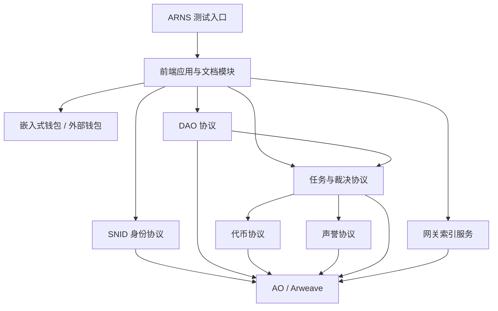

# 第一阶段最小可运行闭环设计

本文基于《文档.md》和《架构设计.md》编写，设计神农书库第一阶段的最小可运行闭环。第一阶段目标调整为：优先支持开发贡献、文档贡献、基础设施贡献和早期治理协作的记录、验收、裁决、代币发放与声誉生成。

第一阶段不再优先实现小说入库、标签、爬虫和评分。这些内容进入后续阶段。

## 目标与范围

第一阶段必须跑通以下闭环：

```text
贡献者访问 ARNS 测试入口
  ↓
前端应用加载
  ↓
贡献者创建或连接嵌入式钱包
  ↓
贡献者创建 SNID
  ↓
DAO 发布或登记任务
  ↓
贡献者领取任务并提交交付证据
  ↓
任务进入挑战期
  ↓
无挑战自动通过，或有挑战进入裁决
  ↓
任务模块完成 tSNLT 付款
  ↓
声誉模块按人类劳动时间生成对应 DAO 声誉
  ↓
网关索引身份、DAO、任务、裁决、付款和声誉
  ↓
前端展示任务状态、代币余额、声誉和贡献记录
```

第一阶段包含：

- 前端应用和 Fumadocs 文档模块；
- 嵌入式钱包；
- SNID 创建；
- 代币；
- 声誉；
- DAO：开发 DAO、推广 DAO、内容 DAO；
- 任务与裁决；
- 网关索引；
- ARNS 测试入口；
- 测试网关服务器部署。

为了满足“记录与发放开发贡献”，第一阶段还需要补充以下能力：

- DAO 注册与资金池；
- 开发任务模板；
- 交付证据记录；
- 代码仓库、提交、PR、Issue、部署记录等外部证据引用；
- 任务预算锁定；
- 劳动报酬与其他开销补贴分账；
- 挑战期参数；
- 裁决者配置；
- 恶意所得剔除记录；
- `tSNLT` 转正式 `SNLT` 的资格记录；
- 网关对任务、付款、声誉和裁决的索引。

第一阶段不包含：

- 小说入库；
- 标签；
- 爬虫批量提交；
- 评分；
- 论坛；
- 书架；
- 黑名单；
- 书单；
- 完整 DAO 治理；
- 正式成员资格和专业票权；
- 复杂处罚和风险继承；
- DEX 和流动性机制；
- 第三方网关切换的完整产品化体验。

第一阶段涉及的模块应尽量完整实现本阶段所需能力。后续可以扩展规则和参数，但不应推翻第一阶段已经产生的身份、任务、付款、声誉和裁决记录。

## 设计原则

### 协议优先

第一阶段产生的关键状态必须以 AO 协议为权威来源。

前端可以展示状态，网关可以索引状态，测试网关服务器可以承载入口，但它们都不是最终事实来源。

### 开发贡献优先

第一阶段优先解决项目早期最现实的问题：如何记录开发者、文档维护者、部署维护者、审查者和裁决者的贡献，并按规则发放代币和声誉。

小说内容侧功能可以后移，但开发贡献的身份、任务、付款和声誉必须先闭环。

### 代币与声誉分账

代币和声誉都以“1分钟人类劳动时间”为基本单位，但用途不同。

代币：

- 1 个代币对应 1 分钟人类劳动时间；
- 可以作为劳动报酬；
- 也可以按规则换算并补贴服务器、域名、网关、代理、审计、工具等其他开销；
- 测试阶段使用 `tSNLT`；
- 测试期合法获得的 `tSNLT` 后续按 1:1 转换为正式 `SNLT`；
- 测试期间恶意所得的 `tSNLT` 会被剔除。

声誉：

- 1 分钟人类劳动时间对应 1 点声誉；
- 只记录已经确认的人类劳动贡献；
- 不用于补偿服务器、域名、工具、代理、第三方采购等货币开销；
- 不可转让、不可出售、不可委托；
- 不随代币转账而转移；
- 问题任务被撤销时，对应声誉可以撤销。

### 任务统一发放

所有面向个人的钱包付款都必须经过任务模块。

DAO 不应绕过任务模块直接向个人地址支付劳动报酬、奖励、裁决报酬或报销。

### 启动期不设特殊任务类型

启动期任务不需要额外设计特殊启动任务类型。

第一阶段可以通过参数实现启动期便利：

- 挑战期设置为几秒；
- 启动期任务不要求质押；
- 裁决者使用测试配置；
- 后续通过治理延长挑战期、增加质押和调整资格。

启动期任务仍然使用普通任务、验收、挑战、裁决、付款和声誉记录流程。

### 可迁移

第一阶段虽然在测试网关服务器运行，但必须为正式阶段迁移保留数据连续性：

- SNID 不能因为迁移而改变；
- 任务记录应可追溯；
- 付款记录应可追溯；
- 声誉记录应可追溯；
- 恶意所得剔除应可追溯；
- 合法 `tSNLT` 到正式 `SNLT` 的转换资格应可计算。

## 既有规则与待确认参数

本文复用主文档中已经明确的规则：

- SNID 使用 `snid:<16位Base64URL字符>` 作为展示格式；
- SNID 由共享 `DIDRegistry Process` 管理；
- 测试阶段代币符号使用 `tSNLT`；
- 代币对应 1 分钟人类劳动时间；
- 声誉对应 1 分钟人类劳动时间；
- 声誉只记录人类劳动贡献；
- 所有个人代币发放必须通过任务模块执行；
- 任务付款必须区分劳动报酬、开销补贴、成本报销、保证金返还和其他款项；
- 声誉不可转让、不可出售、不可委托，不随代币转账而转移；
- 任务被认定无效、虚假、恶意或重复时，可以撤销对应代币转换资格和声誉。

第一阶段需要确认的参数：

- 测试网关服务器域名和访问路径；
- ARNS 测试入口名称；
- 嵌入式钱包供应商或实现方案；
- DAO 初始资金池预算；
- 开发 DAO、推广 DAO、内容 DAO 的初始职责边界；
- 任务挑战期时长；
- 启动期任务是否统一不要求质押；
- 裁决者测试资格；
- 裁决奖励参数；
- 开发任务、文档任务、部署任务、审查任务的默认劳动时间估算规则；
- 开销补贴的申请和验收规则；
- 恶意所得剔除规则；
- `tSNLT` 转正式 `SNLT` 的快照和申诉规则；
- 网关索引刷新间隔；
- 测试环境数据保留策略。

这些参数应进入配置文件、协议参数或 DAO 参数，不应散落在业务逻辑中。

## 模块总览



第一阶段模块关系：

- 前端是统一入口；
- 钱包负责签名和接收付款；
- SNID 协议负责身份创建和授权验证；
- DAO 协议负责开发 DAO、推广 DAO、内容 DAO 的注册、资金池和任务归属；
- 任务与裁决协议负责任务创建、领取、提交、挑战、裁决、通过、拒绝、撤销；
- 代币协议负责 `tSNLT` 测试币、余额、资金池、预算锁定、付款和转换资格；
- 声誉协议负责按 DAO 记录不可转让声誉；
- 网关负责索引身份、DAO、任务、裁决、付款、声誉和测试环境状态；
- 测试网关服务器负责承载测试入口、前端、文档、网关 API 和索引进程。

## 代码组织

第一阶段仍采用单一仓库。

```text
shennong/
  apps/
    web/
    gateway/
  protocols/
    ao/
  packages/
    sdk/
    types/
    config/
```

`apps/web` 同时承载产品界面和 Fumadocs 文档入口。

`apps/gateway` 承载索引服务、查询接口和测试环境健康检查。

`protocols/ao` 承载第一阶段需要部署的 AO Lua 协议进程，包括身份、DAO、代币、声誉、任务与裁决。

`packages/sdk` 封装前端和网关共用的 AO 调用能力。

`packages/types` 保存共享类型定义。

`packages/config` 保存测试环境、协议进程、网关地址、ARNS 入口和任务参数配置。

## 前端应用和 Fumadocs 文档模块设计

### 定位

前端是第一阶段的统一入口。贡献者不需要区分产品应用和文档系统，所有入口都从同一个前端进入。

Fumadocs 文档模块是前端的一部分，用于承载项目介绍、贡献指南、任务规则、DAO 规则、代币与声誉说明、测试环境说明。

### 第一阶段职责

前端应用负责：

- 加载测试环境配置；
- 展示当前连接的钱包状态；
- 引导用户创建 SNID；
- 展示开发 DAO、推广 DAO、内容 DAO；
- 展示 DAO 资金池；
- 展示任务列表；
- 展示任务详情；
- 提供任务创建入口；
- 提供任务领取入口；
- 提供任务交付证据提交入口；
- 提供挑战入口；
- 提供裁决入口；
- 展示 `tSNLT` 余额；
- 展示 `tSNLT` 转正式 `SNLT` 的当前资格状态；
- 展示声誉摘要；
- 展示付款记录；
- 展示网关索引状态；
- 提供文档入口；
- 展示测试环境健康状态。

文档模块负责：

- 说明第一阶段功能范围；
- 说明如何创建钱包和 SNID；
- 说明开发 DAO、推广 DAO、内容 DAO 的职责；
- 说明任务创建、领取、提交、挑战和裁决流程；
- 说明 `tSNLT`、正式转换和恶意所得剔除规则；
- 说明声誉只对应人类劳动时间；
- 说明代币可以用于补贴其他开销；
- 说明启动期任务挑战期短且不要求质押；
- 说明测试环境入口和已知限制。

### 第一阶段页面范围

第一阶段页面包括：

- 首页；
- 身份页；
- DAO 列表页；
- DAO 详情页；
- 任务列表页；
- 任务详情页；
- 任务创建页；
- 任务交付页；
- 挑战页；
- 裁决页；
- 代币余额页；
- 声誉摘要页；
- 付款记录页；
- 转换资格页；
- 测试状态页；
- 文档首页；
- 贡献指南页。

不进入第一阶段的页面：

- 小说列表页；
- 小说详情页；
- 标签提交页；
- 评分页；
- 论坛页；
- 书架页；
- 黑名单页；
- 书单页；
- 完整 DAO 治理页。

### 验收标准

前端应用在第一阶段验收时应满足：

- 用户可以通过 ARNS 测试入口打开前端；
- 用户可以创建或连接钱包；
- 用户可以创建 SNID；
- 用户可以查看开发 DAO、推广 DAO、内容 DAO；
- 用户可以查看任务列表和任务详情；
- 用户可以创建或领取任务；
- 用户可以提交交付证据；
- 用户可以发起挑战；
- 有权限的测试裁决者可以提交裁决结果；
- 用户可以看到 `tSNLT` 余额；
- 用户可以看到付款记录；
- 用户可以看到声誉摘要；
- 用户可以看到 `tSNLT` 转正式 `SNLT` 的资格状态；
- 用户可以访问 Fumadocs 文档模块；
- 页面不会把小说、标签、评分、论坛等后续功能误展示为已上线。

## 嵌入式钱包设计

### 定位

嵌入式钱包用于降低早期贡献者进入门槛，让开发者、文档贡献者、部署维护者和审查者可以快速参与任务、签名和收款。

第一阶段嵌入式钱包主要服务于：

- 创建测试钱包；
- 保存测试钱包访问状态；
- 对创建 SNID、创建任务、领取任务、提交证据、发起挑战、提交裁决等操作签名；
- 展示当前钱包地址；
- 展示 `tSNLT` 余额；
- 接收任务付款；
- 允许用户导出或备份必要信息。

### 安全边界

第一阶段不应把嵌入式钱包描述为长期资产保管方案。

前端必须明确：

- 测试环境可能重置；
- 测试期合法获得的 `tSNLT` 后续按规则 1:1 转换；
- 恶意所得会被剔除；
- 用户应能理解当前操作使用的是哪个钱包；
- 用户应能看到签名操作对应的用途。

### 验收标准

嵌入式钱包在第一阶段验收时应满足：

- 用户可以创建钱包；
- 用户可以恢复或继续使用已有测试钱包；
- 用户可以查看当前钱包地址；
- 用户可以用该钱包创建 SNID；
- 用户可以用该钱包执行任务相关签名；
- 用户可以用该钱包接收 `tSNLT` 任务付款；
- 用户可以区分嵌入式钱包和外部钱包；
- 钱包签名失败时前端能给出明确提示。

## SNID 创建设计

### 定位

SNID 是平台内永久不变的身份主键。第一阶段 SNID 用于绑定贡献记录、任务记录、裁决记录和声誉。

第一阶段 SNID 能力包括：

- 创建 SNID；
- 查询 SNID；
- 查询钱包拥有的 SNID；
- 展示 SNID；
- 判断签名钱包是否可以代表某个 SNID 执行任务操作；
- 查询 SNID 的第一阶段声誉摘要；
- 支持最小 Delegate 能力。

第一阶段不实现：

- 用户名购买；
- displayName 设置；
- 复杂个人资料；
- 身份迁移完整流程；
- 身份停用；
- 恢复方式；
- 认证作者、平台、DAO 或机构。

### 验收标准

SNID 在第一阶段验收时应满足：

- 用户可以创建 SNID；
- 同一个 SNID 可以被前端展示；
- 钱包可以查询到自己关联的 SNID；
- 任务执行、挑战、裁决和声誉必须绑定 SNID；
- 任务付款归属到实际收款钱包；
- 声誉归属到 SNID；
- 未授权钱包不能冒用其他 SNID 执行任务操作；
- 身份数据可以被网关索引和前端读取。

## DAO 设计

### 定位

第一阶段需要直接实现三个基础 DAO：

- 开发 DAO；
- 推广 DAO；
- 内容 DAO。

这三个 DAO 用于记录任务归属、资金池、付款来源和声誉归属。第一阶段不实现完整 DAO 治理，但 DAO 不能只是前端分类，必须在协议中存在可索引、可记账的状态。

### DAO 职责

开发 DAO 负责：

- 前端开发任务；
- 协议开发任务；
- 网关开发任务；
- 部署和基础设施任务；
- 文档和开发者工具任务；
- 代码审查和测试任务。

推广 DAO 负责：

- 测试用户招募；
- 社区说明文档；
- 宣传材料；
- 早期反馈收集；
- 推广渠道维护。

内容 DAO 负责：

- 内容规则整理；
- 标签规则文档；
- 小说数据规则文档；
- 后续小说入库、标签、评分功能的规则准备。

### 第一阶段能力

DAO 协议第一阶段需要支持：

- 创建或初始化开发 DAO、推广 DAO、内容 DAO；
- 查询 DAO；
- 查询 DAO 资金池；
- 查询 DAO 任务；
- 查询 DAO 声誉；
- 任务归属到某个 DAO；
- 任务付款从对应 DAO 资金池支出；
- 声誉生成到对应 DAO。

第一阶段不实现：

- 完整提案治理；
- 完整投票；
- 专业委托票；
- 正式成员资格；
- 复杂资金分配票；
- 子 DAO 成立和撤销流程。

### 验收标准

DAO 在第一阶段验收时应满足：

- 开发 DAO、推广 DAO、内容 DAO 可以被查询；
- 每个 DAO 有独立测试资金池；
- 每个 DAO 可以创建任务；
- 每个 DAO 可以支付任务；
- 每个 DAO 可以生成独立声誉；
- 网关可以索引 DAO、资金池、任务和声誉。

## 代币设计

### 定位

第一阶段使用 `tSNLT` 记录和发放开发贡献。`tSNLT` 不是“随便测试的无效积分”，而是后续按规则 1:1 转换为正式 `SNLT` 的临时代币。

转换时会剔除测试期间恶意所得的代币。

### 第一阶段能力

第一阶段代币能力包括：

- 创建 `tSNLT`；
- 记录钱包余额；
- 记录 DAO 测试资金池余额；
- 支持任务模块锁定预算；
- 支持任务通过后付款；
- 区分劳动报酬、开销补贴、成本报销、保证金返还和其他付款；
- 提供余额查询；
- 提供付款记录查询；
- 提供转换资格查询；
- 标记恶意所得、争议中余额和不可转换余额。

第一阶段代币能力不包括：

- 正式 `SNLT` 主网发行；
- DEX；
- 流动性激励；
- 复杂手续费分配；
- 跨 DAO 资金调拨治理。

### 代币与开销

代币对应人类劳动时间，但可以换算并补贴其他开销。

任务付款应至少区分：

- 人类劳动报酬；
- 服务器开销补贴；
- 域名或网关开销补贴；
- 工具和服务开销补贴；
- 第三方采购；
- 保证金返还；
- 其他付款。

这些付款都可以使用代币支付，但只有人类劳动报酬生成声誉。

### 转正式代币

第一阶段需要记录 `tSNLT` 的转换资格。

转换原则：

- 合法任务所得 `tSNLT` 后续按 1:1 转换为正式 `SNLT`；
- 恶意所得、虚假任务所得、重复任务所得、被撤销任务所得不转换；
- 争议中的 `tSNLT` 暂缓转换；
- 转换资格应可追溯到任务、裁决和付款记录；
- 用户应能在前端看到当前可转换、不可转换和争议中的余额。

### 验收标准

代币在第一阶段验收时应满足：

- 钱包可以查询 `tSNLT` 余额；
- DAO 测试资金池可以查询余额；
- 任务可以锁定预算；
- 任务通过后可以付款；
- 付款可以区分劳动报酬和开销补贴；
- 用户可以查询转换资格；
- 恶意所得可以被标记为不可转换；
- 前端可以展示余额、付款记录和转换资格。

## 声誉设计

### 定位

声誉记录已经确认的人类劳动贡献。

第一阶段声誉绑定 SNID，并按 DAO 分别记录。代币归属于钱包地址，声誉归属于 SNID。

### 发放准则

声誉发放准则为：

```text
1 分钟已确认的人类劳动时间 = 1 点对应 DAO 声誉
```

声誉不用于补偿其他货币开销。

以下内容不生成声誉：

- 服务器费用；
- 域名费用；
- 网关运行费用；
- 代理费用；
- 第三方工具费用；
- 第三方采购费用；
- 保证金返还；
- 赔偿；
- 与人类劳动贡献无关的付款。

### 第一阶段声誉范围

第一阶段至少记录以下声誉：

- 开发 DAO 声誉；
- 推广 DAO 声誉；
- 内容 DAO 声誉；
- 裁决声誉。

裁决声誉可以先归属于发生裁决任务的 DAO，并额外记录 `裁决` 类型，后续再决定是否拆分为独立裁决声誉体系。

### 声誉撤销

如果任务被裁决为无效、虚假、重复、抄袭或恶意提交，应撤销该任务产生的声誉。

第一阶段需要实现：

- 找到任务对应的声誉记录；
- 标记声誉被撤销；
- 从可用声誉摘要中扣除；
- 保留撤销原因和裁决引用。

### 验收标准

声誉在第一阶段验收时应满足：

- 开发任务通过后生成开发 DAO 声誉；
- 推广任务通过后生成推广 DAO 声誉；
- 内容规则任务通过后生成内容 DAO 声誉；
- 裁决任务通过后生成对应 DAO 的裁决类声誉；
- 开销补贴不生成声誉；
- 声誉绑定 SNID，不随钱包转账而转移；
- 被撤销任务可以撤销对应声誉；
- 前端可以展示 SNID 的声誉摘要。

## 任务与裁决设计

### 定位

任务与裁决模块是第一阶段记录与发放开发贡献的核心。

第一阶段所有个人奖励都必须通过任务模块发放。开发、文档、部署、审查、推广、内容规则整理和裁决行为都应被任务模块记录。

### 第一阶段任务类型

第一阶段实现以下任务：

- 开发任务；
- 文档任务；
- 部署维护任务；
- 代码审查任务；
- 测试任务；
- 推广任务；
- 内容规则整理任务；
- 裁决任务。

第一阶段不实现：

- 小说入库任务；
- 标签任务；
- 评分任务；
- 爬虫数据提供任务；
- 竞标型任务；
- 追溯性奖励任务；
- 紧急安全任务。

这些后续任务不需要改变任务模块基本结构，只需要增加任务类型、验收规则和参数。

### 任务字段范围

本文不设计具体接口字段，但第一阶段任务必须能表达以下信息：

- 任务所属 DAO；
- 任务类型；
- 任务标题；
- 任务目标；
- 工作范围；
- 不包含的工作；
- 交付物；
- 交付证据；
- 人类劳动时间估算；
- 劳动报酬；
- 开销补贴；
- 预算锁定；
- 执行者 SNID；
- 执行者收款钱包；
- 挑战期；
- 是否需要质押；
- 任务状态；
- 裁决结果；
- 付款记录；
- 声誉记录。

### 交付证据

为了满足开发贡献记录，任务必须支持交付证据。

交付证据可以包括：

- Git commit；
- Pull Request；
- Issue；
- 代码审查链接；
- 文档修改链接；
- 部署日志；
- 测试报告；
- 截图或录屏；
- Arweave 内容标识；
- 其他可验证证据。

第一阶段不要求把所有外部平台都深度集成，但必须能保存证据引用，并让裁决者和挑战者查看。

### 任务状态

第一阶段任务至少需要表达以下状态：

- 已创建；
- 已领取；
- 已提交；
- 挑战期中；
- 已被挑战；
- 裁决中；
- 已通过；
- 已拒绝；
- 已付款；
- 已撤销。

任务状态必须能被网关索引，并能在前端展示。

### 启动期任务参数

启动期任务不单独设计特殊类型。

启动期可以使用以下参数：

- 挑战期为几秒；
- 不要求执行质押；
- 裁决者使用测试配置；
- 任务模板由早期维护者创建；
- 后续通过治理延长挑战期、增加质押和提高裁决资格。

这些参数必须可配置，不能写死在代码中。

### 标准任务流程

```text
DAO 创建任务
  ↓
任务模块锁定预算
  ↓
贡献者领取任务
  ↓
贡献者提交交付证据
  ↓
进入挑战期
  ↓
无挑战自动通过
  ↓
任务模块付款
  ↓
声誉模块生成人类劳动时间对应声誉
```

有挑战时：

```text
任务进入挑战期
  ↓
挑战者提交挑战
  ↓
任务进入裁决中
  ↓
裁决者查看交付证据和挑战理由
  ↓
裁决者提交裁决结果
  ↓
通过、拒绝或撤销任务
  ↓
按结果付款、返还、标记不可转换或撤销声誉
```

### 裁决范围

第一阶段裁决处理：

- 任务交付物与要求不符；
- 交付证据虚假；
- 重复提交已有成果；
- 抄袭；
- 恶意制造无价值任务；
- 人类劳动时间明显虚高；
- 开销补贴明显虚假；
- 已付款任务后续被证明无效。

第一阶段不处理复杂 DAO 复决、正式成员资格、专业票权和长期处罚继承。

### 验收标准

任务与裁决在第一阶段验收时应满足：

- DAO 可以创建任务；
- 任务可以锁定预算；
- 贡献者可以领取任务；
- 贡献者可以提交交付证据；
- 任务可以进入挑战期；
- 启动期任务可以使用几秒挑战期和免质押参数；
- 无挑战任务可以自动通过；
- 有挑战任务可以进入裁决；
- 裁决可以产生通过、拒绝或撤销结果；
- 通过任务可以付款；
- 人类劳动时间可以生成声誉；
- 开销补贴不生成声誉；
- 恶意所得可以标记为不可转换；
- 撤销任务可以撤销声誉；
- 网关可以索引任务和裁决状态；
- 前端可以展示任务、裁决、付款、转换资格和声誉结果。

## 网关索引设计

### 定位

网关是第一阶段前端体验的读加速层。

网关不是协议后端，不拥有改变协议状态的特殊权限。

### 第一阶段索引范围

网关第一阶段需要索引：

- SNID 创建事件；
- 钱包与 SNID 关系；
- Delegate 状态；
- DAO 创建和资金池事件；
- 任务创建、领取、提交、挑战、裁决、通过、付款、撤销事件；
- 交付证据引用；
- `tSNLT` 余额变化；
- `tSNLT` 转正式 `SNLT` 的资格变化；
- DAO 测试资金池变化；
- 声誉生成和撤销事件；
- 测试环境健康状态。

网关第一阶段不索引：

- 小说；
- 标签；
- 评分；
- 论坛；
- 书架；
- 黑名单；
- 书单。

### 查询能力

第一阶段网关至少需要支持前端读取：

- DAO 列表；
- DAO 详情；
- DAO 资金池；
- 任务列表；
- 任务详情；
- 交付证据；
- 裁决状态；
- 钱包 `tSNLT` 余额；
- `tSNLT` 转正式 `SNLT` 的资格状态；
- SNID 声誉摘要；
- 付款记录；
- 索引同步状态；
- 测试环境健康状态。

本文不设计具体 API 路由。

### 验收标准

网关在第一阶段验收时应满足：

- 可以索引 SNID；
- 可以索引 DAO；
- 可以索引任务；
- 可以索引交付证据引用；
- 可以索引裁决结果；
- 可以索引代币余额；
- 可以索引转换资格；
- 可以索引声誉；
- 可以为前端提供 DAO、任务、付款和声誉读模型；
- 可以展示索引进度和健康状态；
- 网关重启后可以恢复索引。

## ARNS 测试入口设计

### 定位

ARNS 测试入口用于让贡献者从第一阶段开始就通过去中心化名称访问项目。

测试阶段入口目标是统一访问路径，而不是提前完成正式永久部署。

### 访问路径

```text
ARNS 域名
  ↓
网关服务器
  ↓
前端应用与文档模块
  ↓
网关 API / AO 测试协议 / Arweave
```

### 验收标准

ARNS 测试入口在第一阶段验收时应满足：

- 用户可以通过 ARNS 测试入口打开前端；
- 首页能明确显示测试环境状态；
- 文档入口可访问；
- SNID 创建流程可用；
- DAO、任务、代币、声誉页面可访问；
- 测试入口故障时有可排查的健康检查路径。

## 测试网关服务器部署设计

### 定位

测试网关服务器是第一阶段的运行承载环境。

它承担测试入口、前端静态资源、Fumadocs 文档模块、网关 API、索引服务和健康检查。

### 承载内容

测试网关服务器承载：

- 前端应用；
- Fumadocs 文档模块；
- 网关 API；
- 索引进程；
- 索引状态页面；
- 健康检查接口；
- DAO、任务、代币、声誉和裁决读模型；
- 测试环境配置；
- 必要日志。

测试网关服务器不应承载：

- 协议权威状态；
- 用户资产权威状态；
- 最终裁决权；
- DAO 治理最终结果。

### 环境配置

测试环境配置至少包含：

- AO 测试协议进程标识；
- 默认网关 API 地址；
- ARNS 测试入口；
- 开发 DAO、推广 DAO、内容 DAO 配置；
- DAO 测试资金池配置；
- 任务模板配置；
- 启动期挑战期配置；
- 启动期免质押配置；
- 裁决者测试资格配置；
- 声誉分类配置；
- 嵌入式钱包配置；
- Arweave 访问配置；
- 索引起点。

配置应区分开发环境、测试环境和未来正式环境。

### 验收标准

测试网关服务器在第一阶段验收时应满足：

- 可以通过 ARNS 测试入口访问；
- 可以提供前端静态资源；
- 可以提供文档模块；
- 可以运行网关 API；
- 可以运行索引进程；
- 可以展示 DAO、任务、代币、声誉和裁决状态；
- 可以展示健康状态；
- 服务重启后网关可以恢复索引；
- 测试配置不混入正式环境。

## 第一阶段数据流

### 用户注册与 SNID 创建

```text
用户访问前端
  ↓
创建或连接钱包
  ↓
发起创建 SNID
  ↓
钱包签名
  ↓
DIDRegistry Process 创建 SNID
  ↓
网关索引身份
  ↓
前端展示 SNID
```

### 开发贡献发放

```text
开发 DAO 创建任务
  ↓
任务锁定预算
  ↓
贡献者领取任务
  ↓
贡献者提交代码、PR、文档或部署证据
  ↓
任务进入挑战期
  ↓
无挑战自动通过，或挑战后裁决
  ↓
任务模块支付 tSNLT
  ↓
声誉模块生成开发 DAO 声誉
  ↓
网关索引付款和声誉
  ↓
前端展示结果
```

### 开销补贴

```text
任务包含开销补贴
  ↓
贡献者提交费用证据
  ↓
任务通过挑战期或裁决
  ↓
任务模块支付 tSNLT
  ↓
开销补贴不生成声誉
```

### 恶意所得剔除

```text
任务被挑战或复查
  ↓
裁决认定恶意、虚假、重复或无效
  ↓
任务付款被标记为不可转换
  ↓
对应声誉撤销
  ↓
网关索引不可转换余额和撤销记录
```

## 第一阶段验收标准

### 用户侧验收

- 可以通过 ARNS 测试入口打开前端；
- 可以创建或连接钱包；
- 可以创建 SNID；
- 可以查看开发 DAO、推广 DAO、内容 DAO；
- 可以查看任务列表和任务详情；
- 可以领取任务；
- 可以提交交付证据；
- 可以看到 `tSNLT` 余额；
- 可以看到转换资格；
- 可以看到声誉摘要；
- 可以访问文档模块；
- 不会误以为小说、标签、评分、论坛等功能已经可用。

### 协议侧验收

- DIDRegistry Process 可以创建 SNID；
- DAO Process 可以初始化开发 DAO、推广 DAO、内容 DAO；
- Token Process 可以记录 `tSNLT` 余额、资金池、付款和转换资格；
- Task Process 可以记录任务创建、领取、提交、挑战、裁决、付款和撤销；
- Reputation Process 可以生成和撤销声誉；
- 协议不会依赖网关决定权威状态。

### 网关侧验收

- 可以索引身份；
- 可以索引 DAO；
- 可以索引任务；
- 可以索引裁决结果；
- 可以索引代币余额；
- 可以索引转换资格；
- 可以索引声誉；
- 可以提供 DAO、任务、付款、声誉读模型；
- 可以展示索引状态；
- 可以从重启中恢复。

### 部署侧验收

- 测试网关服务器可以承载前端；
- 测试网关服务器可以承载文档模块；
- 测试网关服务器可以运行网关 API；
- 测试网关服务器可以运行索引服务；
- ARNS 测试入口可访问；
- 环境配置区分测试环境和未来正式环境；
- 健康检查可以帮助定位故障。

## 风险与处理策略

### 测试币价值误解风险

风险：用户误以为所有 `tSNLT` 都必然转换为正式代币。

处理：前端和文档明确只有合法任务所得按规则 1:1 转换，恶意所得、虚假任务所得、重复任务所得和争议中余额不会直接转换。

### 声誉误发风险

风险：服务器费用、工具费用等开销被错误计入声誉。

处理：任务付款必须区分人类劳动报酬和开销补贴，声誉只按人类劳动时间生成。

### 启动期挑战期过短风险

风险：几秒挑战期可能让无效任务过快通过。

处理：启动期短挑战期只作为初期效率参数，后续通过治理延长；同时保留任务复查、恶意所得剔除和声誉撤销能力。

### 裁决中心化风险

风险：第一阶段使用测试裁决者配置，用户误以为这就是最终治理结构。

处理：文档明确第一阶段裁决者资格只是测试配置，正式阶段需要接入 DAO 正式成员、专业声誉和治理流程。

### 网关一致性风险

风险：AO 已处理消息，但网关尚未索引，用户误以为失败。

处理：前端区分提交状态、协议确认状态和网关索引状态。

## 暂不设计内容

本文不设计：

- 小说入库；
- 标签；
- 爬虫批量提交；
- 评分；
- 论坛；
- 书架；
- 黑名单；
- 书单；
- 完整 DAO 治理；
- 正式成员资格和专业票权；
- 复杂处罚和风险继承；
- DEX 和流动性机制；
- 第三方网关切换完整产品体验；
- AO 消息字段；
- 数据库表结构；
- 网关 API 路由；
- 前端页面布局；
- 部署脚本；
- 安全审计规则。

这些内容应在第一阶段开发贡献闭环稳定后，分别进入专项设计文档。
