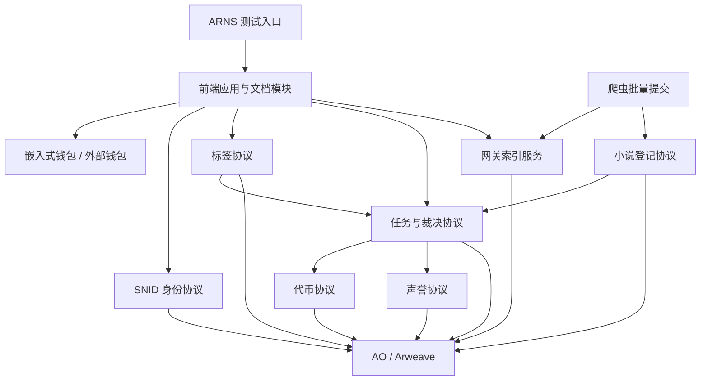

# 第一阶段最小可运行闭环设计

本文基于《文档.md》和《架构设计.md》编写，设计神农书库第一阶段需要完成的最小可运行闭环。本文只设计第一阶段涉及模块的职责、边界、流程和验收标准，不设计接口字段、数据库表结构、具体页面布局、部署脚本或完整长期经济模型。

## 目标与范围

第一阶段目标是让项目从“架构设想”进入“可以真实访问、真实签名、真实提交、真实索引、真实展示”的状态。

第一阶段必须跑通以下闭环：

```text
用户访问 ARNS 测试入口
  ↓
前端应用加载
  ↓
用户创建或连接钱包
  ↓
用户创建 SNID
  ↓
数据提供商通过爬虫批量提交小说
  ↓
AO 协议完成小说入库
  ↓
任务模块记录数据提供任务
  ↓
用户给小说提交标签
  ↓
AO 协议记录标签并创建标签任务
  ↓
任务进入挑战期
  ↓
无挑战则自动确认，或有挑战则进入裁决
  ↓
任务模块完成付款
  ↓
声誉模块生成对应 DAO 声誉
  ↓
网关索引小说、标签、任务、代币和声誉
  ↓
前端展示小说、标签、任务状态、代币余额和声誉
```

第一阶段包含：

- 前端应用和 Fumadocs 文档模块；
- 嵌入式钱包；
- SNID 创建；
- 小说入库；
- 标签；
- 代币；
- 声誉；
- 任务与裁决；
- 网关索引；
- 爬虫批量提交；
- ARNS 测试入口；
- 测试网关服务器部署。

第一阶段不包含：

- 评分；
- 论坛；
- 书架；
- 黑名单；
- 书单；
- 完整 DAO 治理；
- 第三方网关切换的完整产品化体验；
- 多数据提供商协作治理；
- 复杂处罚和风险继承；
- 完整正式代币经济治理；
- 复杂标签 DAO 资金池和互斥标签治理；
- 竞标型任务、追溯性奖励任务和紧急安全任务。

第一阶段可以为后续功能预留清晰边界，但不能为了预留边界而阻塞最小闭环。

## 设计原则

### 协议优先

第一阶段产生的关键状态必须以 AO 协议为权威来源。

前端可以展示状态，网关可以索引状态，爬虫可以提交状态变化请求，但它们都不是最终事实来源。

### 网关加速

前端默认通过网关读取小说列表、小说详情、标签列表和索引状态。

网关只做读模型、缓存和索引，不拥有改变协议事实的特殊权限。

### 最小经济治理闭环

第一阶段需要实现最小代币、声誉、任务与裁决闭环。

测试阶段使用 `tSNLT`。所有面向个人的钱包付款都必须经过任务模块，劳动报酬付款完成后生成对应 DAO 声誉。

第一阶段不实现完整正式代币经济治理，但必须验证以下链路：

```text
DAO 测试资金池
  ↓
任务模块锁定预算
  ↓
贡献者完成任务
  ↓
挑战期或裁决确认
  ↓
任务模块支付 tSNLT
  ↓
声誉模块生成声誉
```

### 可替换运行者

第一阶段虽然由测试网关服务器承载入口和服务，但架构上仍要保持可替换：

- 前端可以迁移到 Arweave；
- 网关可以重新部署；
- 爬虫可以由其他数据提供商运行；
- 协议状态可以通过 AO 和 Arweave 恢复。

### 配置优先

除主文档已经明确的规则外，第一阶段不新增不可解释的硬编码参数。

必须使用的环境差异，例如测试 AO 进程标识、测试网关地址、ARNS 测试入口、爬虫任务范围，应放入配置。

## 既有规则与待确认参数

本文复用主文档中已经明确的规则：

- SNID 使用 `snid:<16位Base64URL字符>` 作为展示格式；
- SNID 由共享 `DIDRegistry Process` 管理；
- 小说使用递增 `BookID` 作为协议内部唯一标识；
- 数据提供商可以提交小说基础数据和热数据；
- 数据提供商不能自行改变刷量确认、冻结和处罚等协议治理状态；
- 小说正式入库的最低字数沿用主文档的 `20,000` 字规则；
- 标签用于小说筛选；
- 测试阶段代币符号使用 `tSNLT`；
- 所有个人代币发放必须通过任务模块执行；
- 任务付款必须区分劳动报酬、成本报销、保证金返还和其他款项；
- 只有劳动报酬产生声誉；
- `获得1个代币的有效劳动报酬 = 获得对应DAO的1点声誉`；
- 声誉不可转让、不可出售、不可委托，不随代币转账而转移；
- 标签确认后可以生成标签 DAO 声誉；
- 数据提供商劳动报酬生成小说登记 DAO 或内容 DAO 声誉。

第一阶段需要后续确认的参数：

- 测试网关服务器域名和访问路径；
- ARNS 测试入口名称；
- 第一批支持的小说来源平台；
- 第一批内置标签集合；
- 每条爬虫批次允许的最大记录数量；
- 网关索引刷新间隔；
- 测试环境数据保留策略；
- 嵌入式钱包供应商或实现方案；
- 第一阶段 DAO 测试资金池预算；
- 数据提供任务的劳动报酬和成本报销参数；
- 标签任务的劳动报酬参数；
- 任务挑战期时长；
- 裁决者资格和裁决奖励参数；
- 任务失败、撤销和声誉撤销规则。

这些参数在实现时应进入配置文件、环境变量或协议参数，不应散落在业务逻辑中。

## 模块总览



第一阶段的模块关系应保持简单：

- 前端是统一入口；
- 钱包负责签名；
- SNID 协议负责身份创建和授权判断；
- 小说登记协议负责 BookID 和小说状态；
- 标签协议负责记录用户对小说的标签提交；
- 代币协议负责 `tSNLT` 测试币余额、资金池和任务付款；
- 声誉协议负责按 DAO 记录不可转让声誉；
- 任务与裁决协议负责标准化任务、挑战期、裁决结果和付款触发；
- 爬虫负责把来源平台数据变成批次提交；
- 网关负责把 AO 和 Arweave 数据整理成前端可快速读取的视图；
- 测试网关服务器负责承载测试入口、前端、文档、网关 API 和索引进程。

## 代码组织

第一阶段仍采用单一仓库。

```text
shennong/
  apps/
    web/
    gateway/
    crawler/
  protocols/
    ao/
  packages/
    sdk/
    types/
    config/
```

`apps/web` 同时承载产品界面和 Fumadocs 文档入口。

`apps/gateway` 承载索引服务、查询接口和测试环境必要的健康检查。

`apps/crawler` 承载数据提供商爬虫和批次提交工具。

`protocols/ao` 承载第一阶段需要部署的 AO Lua 协议进程，包括身份、小说登记、标签、代币、声誉、任务与裁决。

`packages/sdk` 封装前端、网关和爬虫共用的 AO 调用能力。

`packages/types` 保存共享类型定义。

`packages/config` 保存测试环境、协议进程、网关地址和部署环境配置。

## 前端应用和 Fumadocs 文档模块设计

### 定位

前端是第一阶段的统一入口。用户不需要区分产品应用和文档系统，所有入口都从同一个前端进入。

Fumadocs 文档模块是前端的一部分，用于承载项目介绍、协议说明、数据提供商说明和测试阶段操作指南。

### 第一阶段职责

前端应用负责：

- 加载测试环境配置；
- 展示当前连接的钱包状态；
- 引导用户创建 SNID；
- 展示小说列表；
- 展示小说详情；
- 展示小说标签；
- 提供标签提交入口；
- 展示 `tSNLT` 测试币余额；
- 展示任务状态；
- 展示声誉摘要；
- 提供最小裁决入口；
- 展示提交后的协议处理状态；
- 展示网关索引状态；
- 提供文档入口；
- 展示测试环境健康状态。

文档模块负责：

- 说明项目目标；
- 说明第一阶段功能范围；
- 说明如何创建钱包和 SNID；
- 说明如何浏览小说和提交标签；
- 说明 `tSNLT`、任务付款和声誉生成规则；
- 说明第一阶段挑战期和裁决流程；
- 说明数据提供商如何运行爬虫；
- 说明测试环境入口和已知限制。

### 第一阶段页面范围

第一阶段只需要最小页面集合：

- 首页；
- 小说列表页；
- 小说详情页；
- 标签提交页或标签提交弹窗；
- 身份页；
- 任务状态页；
- 裁决处理页；
- 声誉摘要页；
- 测试状态页；
- 文档首页；
- 数据提供商文档页。

不进入第一阶段的页面：

- 评分页；
- 论坛页；
- 书架页；
- 黑名单页；
- 书单页；
- DAO 治理页；
- 完整任务市场页；
- 复杂处罚详情页。

### 与其他模块的关系

前端读取数据时：

```text
前端
  ↓
网关
  ↓
AO / Arweave
```

前端提交操作时：

```text
前端
  ↓
钱包签名
  ↓
AO 协议
  ↓
网关索引
  ↓
前端刷新展示
```

前端需要清楚区分两类状态：

- 协议已确认状态；
- 网关已索引状态。

当协议已确认但网关尚未索引时，前端应提示用户等待索引同步，而不是误判提交失败。

### 验收标准

前端应用在第一阶段验收时应满足：

- 用户可以通过 ARNS 测试入口打开前端；
- 用户可以创建或连接钱包；
- 用户可以创建 SNID；
- 用户可以浏览已入库小说；
- 用户可以查看小说标签；
- 用户可以提交标签；
- 用户可以看到提交结果；
- 用户可以看到 `tSNLT` 测试币余额；
- 用户可以看到任务状态；
- 用户可以看到声誉摘要；
- 有权限的测试用户可以处理最小裁决；
- 用户可以访问 Fumadocs 文档模块；
- 用户可以看到测试环境状态；
- 当前页面不会把评分、论坛、书架、黑名单、书单误展示为可用功能。

## 嵌入式钱包设计

### 定位

嵌入式钱包用于降低 Web2 用户进入门槛，让用户可以在没有外部钱包知识的情况下完成测试阶段体验。

第一阶段嵌入式钱包主要服务于：

- 创建测试钱包；
- 保存测试钱包访问状态；
- 对创建 SNID、提交标签、领取任务、提交裁决等操作签名；
- 展示当前钱包地址；
- 展示 `tSNLT` 测试币余额；
- 允许用户导出或备份必要信息。

### 与外部钱包的边界

第一阶段应同时保留外部钱包连接能力，但不要求外部钱包体验完整。

推荐路径：

- 普通测试用户使用嵌入式钱包；
- 高级测试用户可以连接外部钱包；
- 同一个 SNID 的 Owner 和 Delegate 关系按协议规则处理；
- 高价值资产和正式治理不依赖第一阶段嵌入式钱包。

### 第一阶段安全边界

第一阶段不应把嵌入式钱包描述为长期资产保管方案。

前端必须明确测试阶段风险：

- 测试环境可能重置；
- 测试钱包不建议存放高价值资产；
- 用户应能理解当前操作使用的是哪个钱包；
- 用户应能看到签名操作对应的用途。

### 验收标准

嵌入式钱包在第一阶段验收时应满足：

- 用户可以创建钱包；
- 用户可以恢复或继续使用已有测试钱包；
- 用户可以查看当前钱包地址；
- 用户可以用该钱包创建 SNID；
- 用户可以用该钱包提交标签；
- 用户可以用该钱包领取或确认第一阶段任务；
- 用户可以用该钱包接收 `tSNLT` 任务付款；
- 用户可以区分嵌入式钱包和外部钱包；
- 钱包签名失败时前端能给出明确提示。

## SNID 创建设计

### 定位

SNID 是平台内永久不变的身份主键。第一阶段只实现身份闭环需要的最小能力。

第一阶段 SNID 能力包括：

- 创建 SNID；
- 查询 SNID；
- 查询钱包拥有的 SNID；
- 展示 SNID；
- 判断签名钱包是否可以代表某个 SNID 提交标签；
- 查询 SNID 的第一阶段声誉摘要；
- 支持最小 Delegate 能力。

第一阶段不实现：

- 用户名购买；
- displayName 设置；
- 复杂个人资料；
- 身份迁移完整流程；
- 身份停用；
- 恢复方式；
- 认证作者、平台、DAO 或机构。

### Owner 与 Delegate

第一阶段至少需要支持以下两种路径：

```text
路径一：嵌入式钱包直接作为 Owner
```

这条路径用于最简单的 Web2 测试用户体验。

```text
路径二：外部钱包作为 Owner，嵌入式钱包作为 Delegate
```

这条路径用于验证后续正式使用方式。

第一阶段 Delegate 只需要覆盖普通操作范围，例如标签提交。Delegate 不应拥有迁移 SNID、修改恢复方式或管理其他 Delegate 的权限。

### 创建流程

```text
用户打开前端
  ↓
创建或连接钱包
  ↓
前端发起创建 SNID 请求
  ↓
钱包签名
  ↓
DIDRegistry Process 创建 SNID
  ↓
前端显示 SNID
  ↓
网关索引身份状态
```

第一阶段允许通过 Relayer 或测试网关辅助提交创建消息，但协议本身不应依赖某个中心化 Relayer 才能创建 SNID。

### 协议职责

DIDRegistry Process 负责：

- 生成 SNID；
- 检查 SNID 是否重复；
- 记录 Owner；
- 记录最小状态；
- 记录 Delegate；
- 提供查询能力。

业务协议在用户提交标签时负责验证：

- SNID 是否存在；
- SNID 是否处于可用状态；
- 签名钱包是否为 Owner；
- 或签名钱包是否拥有标签提交 Delegate 权限。

### 验收标准

SNID 在第一阶段验收时应满足：

- 用户可以创建 SNID；
- 同一个 SNID 可以被前端展示；
- 钱包可以查询到自己关联的 SNID；
- 用户提交标签时必须带上 SNID；
- 任务生成的声誉必须绑定 SNID；
- 未授权钱包不能冒用其他 SNID 提交标签；
- Delegate 权限可以支持标签提交；
- 身份数据可以被网关索引和前端读取。

## 小说入库设计

### 定位

小说入库是第一阶段内容数据闭环的核心。没有小说入库，就无法验证标签、筛选和索引。

第一阶段小说入库由数据提供商通过爬虫批量提交，AO 小说登记协议统一分配 BookID。

### 数据范围

第一阶段小说信息分为三类：

- 基础数据；
- 热数据；
- 协议状态。

基础数据包括：

- 首发平台；
- 首发平台书籍 ID；
- 书名；
- 作者名；
- 作者在首发平台的 ID；
- 阅读链接列表；
- 封面链接；
- 简介；
- 频道。

热数据包括：

- 字数；
- 最新章节；
- 来源平台显示的最近更新时间；
- 连载状态；
- 数据采集时间。

协议状态第一阶段只需要支持最小集合：

- 正常；
- 重复；
- 无效；
- 来源已下架。

刷量确认、冻结、合并、处罚和复杂治理状态不进入第一阶段完整流程。

### 入库流程

```text
爬虫扫描来源平台
  ↓
数据提供商筛选符合条件的小说
  ↓
生成新增小说批次
  ↓
提交小说登记 AO Process
  ↓
AO Process 做确定性基本检查
  ↓
通过后分配 BookID
  ↓
任务模块记录数据提供任务进度
  ↓
记录平台书籍索引
  ↓
网关索引新增小说
  ↓
前端展示小说
```

### AO 协议职责

小说登记协议负责：

- 分配 BookID；
- 保存小说基础数据；
- 保存小说热数据；
- 保存协议状态；
- 建立平台书籍索引；
- 检查批次幂等性；
- 拒绝明显无效提交；
- 返回每条记录处理结果。

AO 协议只做确定性检查，不访问来源平台验证事实。

小说登记协议通过批次结果向任务模块提供验收依据。任务模块根据成功入库数量、热数据更新结果、空增量批次和故障报告判断数据提供任务是否完成。

### 数据提供商职责

数据提供商负责：

- 判断小说是否达到入库条件；
- 判断是否属于支持的小说类型；
- 判断是否明显重复；
- 判断是否为新增小说；
- 判断是否为已有小说的新阅读链接；
- 提交来源平台展示的基础数据和热数据；
- 对错误入库承担后续纠错责任。

数据提供商的劳动报酬和成本报销必须通过任务模块结算。只有劳动报酬部分生成小说登记 DAO 或内容 DAO 声誉。

### 失败处理

第一阶段需要支持以下失败结果：

- 已存在；
- 字段格式错误；
- 字数不足；
- 缺少必填字段；
- 提交者无权限；
- 批次已处理；
- 其他拒绝原因。

失败记录不应阻塞同批次中其他有效记录。

数据提供商修正失败记录时，应使用新的批次标识，并保留修正原因。

### 验收标准

小说入库在第一阶段验收时应满足：

- 数据提供商可以批量提交新增小说；
- AO 协议可以分配 BookID；
- 重复的平台书籍 ID 不会生成新的 BookID；
- 入库结果可以被网关索引；
- 数据提供任务可以进入任务模块；
- 数据提供任务可以在验收后付款并生成声誉；
- 前端可以展示新增小说；
- 热数据变化可以被提交并展示；
- 错误记录不会导致整个系统不可用。

## 标签设计

### 定位

标签是第一阶段用户参与内容建设的核心功能。

第一阶段标签功能服务于：

- 验证用户签名提交；
- 验证 SNID 与内容贡献绑定；
- 验证小说详情页展示标签；
- 验证按标签筛选小说；
- 验证标签任务、挑战期、裁决、付款和声誉生成。

### 第一阶段能力

第一阶段标签功能包括：

- 展示内置标签集合；
- 用户对已入库小说提交标签；
- 标签提交绑定 SNID；
- 标签提交记录实际签名钱包；
- 同一用户对同一小说和同一标签的重复提交可被识别；
- 标签提交自动创建标准化标签任务；
- 标签任务通过挑战期后可以支付 `tSNLT`；
- 标签任务通过后可以生成标签 DAO 声誉；
- 有挑战时可以进入最小裁决流程；
- 网关统计小说的标签结果；
- 前端按标签展示和筛选小说。

第一阶段标签功能不包括：

- 新增标签名称的完整治理；
- 标签互斥规则的完整裁决；
- 标签 DAO 资金池；
- 复杂标签争议仲裁；
- 真实主网资产质押。

### 标签提交流程

```text
用户打开小说详情
  ↓
前端读取可用标签
  ↓
用户选择标签
  ↓
前端检查用户是否拥有 SNID
  ↓
钱包签名
  ↓
标签协议验证 SNID 和签名钱包
  ↓
标签协议记录提交
  ↓
任务模块创建标签任务
  ↓
进入挑战期
  ↓
无挑战自动确认，或有挑战进入裁决
  ↓
任务模块支付 tSNLT
  ↓
声誉模块生成标签 DAO 声誉
  ↓
网关索引标签
  ↓
前端展示标签结果
```

### 协议职责

标签协议第一阶段负责：

- 校验 BookID 是否存在；
- 校验 SNID 是否存在；
- 校验签名钱包是否有权代表 SNID；
- 校验标签是否属于第一阶段允许集合；
- 记录标签提交；
- 记录提交时间；
- 记录签名钱包；
- 创建或关联标准化标签任务；
- 将挑战期状态提供给任务与裁决协议；
- 提供按小说查询标签的能力；
- 提供按 SNID 查询标签贡献的能力。

### 网关职责

网关第一阶段负责：

- 聚合同一本小说的标签；
- 提供小说详情页标签视图；
- 提供按标签筛选小说的读模型；
- 标记网关索引延迟；
- 在展示中区分协议已确认和索引已同步。

### 最小经济结算

主文档中的标签长期设计包含质押、奖励、挑战和裁决。

第一阶段需要实现最小经济结算。第一阶段标签可以采用以下处理方式：

- 协议记录标签提交事实；
- 标签提交自动创建标准化任务；
- 标签任务锁定测试预算；
- 标签任务进入挑战期；
- 无挑战时自动确认；
- 有挑战时进入最小裁决流程；
- 任务通过后向提交者钱包支付 `tSNLT`；
- 劳动报酬生成标签 DAO 声誉。

第一阶段可以使用测试参数和测试代币验证质押体验，但必须在文档和前端中明确不代表正式主网资产规则。

### 验收标准

标签在第一阶段验收时应满足：

- 用户可以在小说详情中看到标签入口；
- 用户必须使用 SNID 提交标签；
- 未授权钱包不能代替他人 SNID 提交标签；
- 提交成功后协议能记录标签；
- 标签提交可以创建任务；
- 标签任务通过后可以支付 `tSNLT`；
- 标签任务通过后可以生成标签 DAO 声誉；
- 标签挑战可以进入最小裁决流程；
- 网关能索引标签；
- 前端能展示标签；
- 前端能按标签筛选小说；
- 页面不出现评分入口或评分结果。

## 代币设计

### 定位

第一阶段使用测试币 `tSNLT` 验证代币流转、任务付款和声誉生成，不代表正式 `SNLT` 的主网发行结果。

正式代币仍应遵守主文档中的零预挖、公平发行、统一发行合约和每日增发规则。

第一阶段代币模块的目标不是完成完整经济治理，而是跑通以下链路：

```text
tSNLT 测试发行
  ↓
DAO 测试资金池
  ↓
任务模块锁定预算
  ↓
任务通过挑战期或裁决
  ↓
任务模块付款到钱包
  ↓
声誉模块按劳动报酬生成声誉
```

### 第一阶段能力

第一阶段代币能力包括：

- 创建 `tSNLT` 测试代币；
- 记录钱包余额；
- 记录 DAO 测试资金池余额；
- 支持任务模块锁定预算；
- 支持任务通过后付款；
- 区分劳动报酬、成本报销、保证金返还和其他付款；
- 提供余额查询；
- 提供付款记录查询。

第一阶段代币能力不包括：

- 正式 `SNLT` 主网发行；
- 完整每日增发治理；
- DEX；
- 流动性激励；
- 广告收入；
- 复杂手续费分配；
- 跨 DAO 资金调拨治理。

### 测试资金池

第一阶段至少需要以下测试资金池：

- 内容 DAO 测试资金池；
- 小说登记预算；
- 标签预算；
- 裁决预算。

这些资金池用于验证任务付款，不代表正式 DAO 预算结构。

测试资金池余额来源可以是测试发行或测试环境初始化配置。正式环境不得沿用测试初始化方式。

### 付款规则

所有面向个人的钱包付款必须经过任务模块。

任务付款需要区分：

- 劳动报酬；
- 成本报销；
- 审核或裁决奖励；
- 保证金返还；
- 其他付款。

只有劳动报酬生成声誉。

例如数据提供商任务可以拆分为：

- 劳动报酬；
- 服务器费用；
- 代理费用；
- 其他实际成本。

其中只有劳动报酬生成小说登记 DAO 或内容 DAO 声誉。

### 验收标准

代币在第一阶段验收时应满足：

- 钱包可以查询 `tSNLT` 余额；
- DAO 测试资金池可以查询余额；
- 任务可以锁定预算；
- 任务通过后可以付款；
- 付款可以区分劳动报酬和非劳动付款；
- 劳动报酬可以触发声誉生成；
- 非劳动付款不会生成声誉；
- 前端可以展示余额和任务付款记录。

## 声誉设计

### 定位

声誉记录贡献者已经通过任务确认的有效劳动贡献。

第一阶段声誉绑定 SNID，并按 DAO 分别记录。代币归属于钱包地址，声誉归属于 SNID。

第一阶段声誉模块用于验证：

- 数据提供任务完成后生成声誉；
- 标签任务完成后生成声誉；
- 裁决任务完成后生成声誉；
- 问题任务被撤销时可以撤销对应声誉；
- 前端可以展示用户声誉摘要。

### 第一阶段声誉范围

第一阶段至少记录以下声誉：

- 内容 DAO 声誉；
- 小说登记声誉；
- 标签 DAO 声誉；
- 裁决声誉。

如果第一阶段尚未建立独立子 DAO，可以先把小说登记声誉、标签声誉和裁决声誉作为内容 DAO 下的预算分类声誉记录，同时保留未来迁移到独立 DAO 的来源标记。

### 声誉生成规则

第一阶段沿用主文档规则：

```text
获得 1 个代币的有效劳动报酬 = 获得对应 DAO 的 1 点声誉
```

声誉只由劳动报酬生成。

不生成声誉的付款包括：

- 成本报销；
- 服务器费用；
- 代理费用；
- 保证金返还；
- 赔偿；
- 与实际劳动无关的其他付款。

### 声誉撤销

如果任务被裁决为无效、虚假、重复、抄袭或恶意提交，应撤销该任务产生的声誉。

第一阶段只需要实现最小撤销能力：

- 找到任务对应的声誉记录；
- 标记声誉被撤销；
- 从可用声誉摘要中扣除；
- 保留撤销原因和裁决引用。

复杂处罚、风险继承和正式成员资格不进入第一阶段。

### 验收标准

声誉在第一阶段验收时应满足：

- 标签任务通过后生成标签 DAO 声誉；
- 数据提供任务通过后生成小说登记 DAO 或内容 DAO 声誉；
- 裁决任务通过后生成裁决声誉；
- 非劳动付款不生成声誉；
- 声誉绑定 SNID，不随钱包转账而转移；
- 被撤销任务可以撤销对应声誉；
- 前端可以展示 SNID 的声誉摘要。

## 任务与裁决设计

### 定位

任务与裁决模块是第一阶段经济治理闭环的核心。

第一阶段所有个人奖励都必须通过任务模块发放。标签提交、数据提供商批量入库、热数据更新和裁决行为都应被任务模块记录。

### 第一阶段任务类型

第一阶段只实现标准化任务。

标准化任务包括：

- 标签提交任务；
- 新小说批量入库任务；
- 热数据增量更新任务；
- 空增量批次任务；
- 裁决任务。

第一阶段不实现：

- 竞标型任务；
- 追溯性奖励任务；
- 创世启动任务；
- 紧急安全任务；
- 开发任务完整流程；
- 文档任务完整流程；
- 推广任务完整流程。

### 任务状态

第一阶段任务至少需要表达以下状态：

- 已创建；
- 待挑战期结束；
- 已被挑战；
- 裁决中；
- 已通过；
- 已拒绝；
- 已付款；
- 已撤销。

任务状态必须能被网关索引，并能在前端展示。

### 标准化任务流程

```text
协议事件发生
  ↓
任务模块自动创建任务
  ↓
锁定预算
  ↓
进入挑战期
  ↓
无挑战则自动通过
  ↓
任务模块付款
  ↓
声誉模块生成声誉
```

有挑战时：

```text
任务进入挑战期
  ↓
挑战者提交挑战
  ↓
任务进入裁决中
  ↓
裁决者提交裁决结果
  ↓
通过、拒绝或撤销任务
  ↓
按结果付款、返还、罚没或撤销声誉
```

### 裁决范围

第一阶段裁决只处理最小争议：

- 标签明显不适用于小说；
- 标签重复或无效；
- 数据提供商提交明显错误数据；
- 数据提供商未完成约定扫描范围；
- 任务交付物与任务规则不符；
- 已付款任务后续被证明无效。

第一阶段不处理复杂刷量治理、作者级风险继承、平台级风险继承和完整 DAO 复决。

### 裁决者资格

第一阶段可以使用测试裁决者配置验证流程。

裁决者至少应满足：

- 拥有 SNID；
- 与提交者和挑战者不是同一签名钱包；
- 与被裁决任务没有直接执行关系；
- 满足测试环境配置的最小资格。

正式裁决者资格、正式成员门槛和专业票权不在第一阶段展开。

### 付款与声誉

任务通过后：

- 劳动报酬支付给任务执行者钱包；
- 成本报销支付给对应收款钱包；
- 裁决奖励支付给裁决者钱包；
- 劳动报酬生成执行者对应 DAO 声誉；
- 裁决劳动报酬生成裁决声誉。

任务被拒绝或撤销时：

- 未付款预算退回对应测试资金池；
- 已生成声誉应按裁决结果撤销；
- 是否罚没保证金由第一阶段测试参数决定。

### 验收标准

任务与裁决在第一阶段验收时应满足：

- 标签提交可以自动创建任务；
- 数据提供商批次可以关联任务；
- 任务可以进入挑战期；
- 无挑战任务可以自动通过；
- 有挑战任务可以进入裁决；
- 裁决可以产生通过、拒绝或撤销结果；
- 通过任务可以付款；
- 付款中的劳动报酬可以生成声誉；
- 撤销任务可以撤销声誉；
- 网关可以索引任务和裁决状态；
- 前端可以展示任务、裁决、付款和声誉结果。

## 网关索引设计

### 定位

网关是第一阶段前端体验的读加速层。

网关不是协议后端，不拥有改变协议状态的特殊权限。

### 第一阶段索引范围

网关第一阶段需要索引：

- SNID 创建事件；
- 钱包与 SNID 关系；
- Delegate 状态；
- 小说入库事件；
- 小说热数据更新事件；
- 标签提交事件；
- `tSNLT` 余额变化；
- DAO 测试资金池变化；
- 任务状态变化；
- 裁决结果；
- 声誉生成和撤销事件；
- 批次处理结果；
- 测试环境健康状态。

网关第一阶段不索引：

- 评分；
- 论坛；
- 书架；
- 黑名单；
- 书单；
- 完整 DAO 治理；
- 复杂处罚和风险继承。

### 查询能力

第一阶段网关至少需要支持前端读取：

- 小说列表；
- 小说详情；
- 按标签筛选小说；
- 小说标签聚合；
- 钱包关联的 SNID；
- SNID 基础状态；
- 钱包 `tSNLT` 余额；
- SNID 声誉摘要；
- 任务状态；
- 裁决状态；
- 数据提供商批次结果；
- 索引同步状态；
- 测试环境健康状态。

本文不设计具体 API 路由。

### 索引状态

网关需要暴露索引状态，帮助前端解释延迟。

前端应能区分：

- AO 消息已提交；
- AO 消息已处理；
- 网关已索引；
- 前端已刷新。

如果用户刚提交标签，前端可以先展示本地待同步状态，再等待网关确认。

### 权威性声明

网关返回的数据必须能追溯到 AO 消息或 Arweave 内容。

当网关数据与协议数据不一致时，以 AO 协议状态为准。

### 验收标准

网关在第一阶段验收时应满足：

- 可以索引 SNID；
- 可以索引小说；
- 可以索引热数据更新；
- 可以索引标签；
- 可以索引代币余额变化；
- 可以索引任务状态；
- 可以索引裁决结果；
- 可以索引声誉生成和撤销；
- 可以为前端提供小说列表；
- 可以为前端提供小说详情；
- 可以为前端提供按标签筛选结果；
- 可以为前端提供任务和声誉读模型；
- 可以展示索引进度和健康状态；
- 网关重启后可以恢复索引。

## 爬虫批量提交设计

### 定位

爬虫是数据提供商采集小说信息的工具。

第一阶段爬虫用于验证数据提供商工作流，不追求覆盖所有来源平台。

### 工作流

```text
读取配置
  ↓
读取网关或 AO 当前状态
  ↓
扫描来源平台
  ↓
识别新增小说和热数据变化
  ↓
生成批次
  ↓
数据提供商钱包签名
  ↓
提交 AO 协议
  ↓
任务模块更新数据提供任务
  ↓
记录批次结果
  ↓
等待网关索引
```

### 新小说批量提交

第一阶段爬虫需要支持新增小说批量提交。

提交前，爬虫应尽量在本地排除：

- 明显不足入库条件的小说；
- 已经入库的小说；
- 明显重复的小说；
- 非小说页面；
- 来源不明确的数据；
- 采集失败的数据。

最终 AO 协议仍需进行确定性基本检查。

新增小说批次被协议接受后，应关联到数据提供任务。任务是否通过取决于批次结果、扫描范围和挑战期结果。

### 热数据增量更新

第一阶段爬虫需要支持热数据增量更新。

热数据没有变化时，不应重复提交完整数据。

热数据变化包括：

- 字数变化；
- 最新章节变化；
- 来源平台显示的最近更新时间变化；
- 连载状态变化；
- 来源平台删除或下架；
- 对错误热数据的纠正。

### 空增量批次和故障报告

如果爬虫完成了扫描但没有发现变化，应提交空增量批次。

空增量批次也应进入任务模块，用于证明数据提供商在该周期内执行了约定扫描任务。

如果爬虫未能完成扫描，应提交故障报告，而不是提交正常空增量批次。

故障情况包括：

- 来源平台请求失败；
- 页面解析失败；
- 验证码或访问限制；
- 代理不可用；
- 本地状态不可用；
- 只扫描了部分任务范围。

### 与网关的关系

爬虫可以读取网关提供的当前索引状态，但最终应以 AO 协议当前接受的状态作为增量基准。

网关可以帮助爬虫提高效率，但不能替代协议状态。

### 验收标准

爬虫在第一阶段验收时应满足：

- 可以读取任务配置；
- 可以扫描至少一个测试来源平台；
- 可以生成新增小说批次；
- 可以提交新增小说批次；
- 可以生成热数据增量批次；
- 可以提交空增量批次；
- 可以把批次结果关联到数据提供任务；
- 可以在任务通过后获得 `tSNLT` 付款和声誉；
- 可以记录提交结果；
- 可以处理部分失败；
- 批次提交结果可以被网关索引。

## ARNS 测试入口设计

### 定位

ARNS 测试入口用于让用户从第一阶段开始就通过去中心化名称访问项目。

测试阶段入口目标是统一访问路径，而不是提前完成正式永久部署。

### 访问路径

测试阶段访问路径：

```text
ARNS 域名
  ↓
网关服务器
  ↓
前端应用与文档模块
  ↓
网关 API / AO 测试协议 / Arweave
```

测试阶段需要保证：

- ARNS 入口可以访问前端；
- 文档入口在同一前端内；
- 网关 API 和前端部署环境匹配；
- 用户能识别当前是测试环境；
- 正式部署前可以替换为 Arweave 上的永久前端。

### 正式迁移边界

第一阶段不要求完成正式 Arweave 前端部署。

但第一阶段前端构建方式应避免绑定单一服务器路径，后续可以迁移到：

```text
ARNS 域名
  ↓
Arweave 上的永久前端应用与文档模块
  ↓
可配置网关
```

### 验收标准

ARNS 测试入口在第一阶段验收时应满足：

- 用户可以通过 ARNS 测试入口打开前端；
- 首页能明确显示测试环境状态；
- 文档入口可访问；
- 小说列表可访问；
- SNID 创建流程可用；
- 标签提交流程可用；
- 任务、代币和声誉状态可访问；
- 测试入口故障时有可排查的健康检查路径。

## 测试网关服务器部署设计

### 定位

测试网关服务器是第一阶段的运行承载环境。

它承担测试入口、前端静态资源、Fumadocs 文档模块、网关 API、索引服务和健康检查。

### 承载内容

测试网关服务器承载：

- 前端应用；
- Fumadocs 文档模块；
- 网关 API；
- 索引进程；
- 索引状态页面；
- 健康检查接口；
- 任务、代币、声誉和裁决读模型；
- 测试环境配置；
- 必要的日志。

测试网关服务器不应承载：

- 协议权威状态；
- 用户资产权威状态；
- 标签最终裁决权；
- 小说是否刷量的最终判断权；
- DAO 治理最终结果。

### 环境配置

测试环境配置至少包含：

- AO 测试协议进程标识；
- 默认网关 API 地址；
- ARNS 测试入口；
- 支持的来源平台；
- 内置标签集合；
- DAO 测试资金池配置；
- 任务奖励和挑战期配置；
- 裁决者测试资格配置；
- 声誉分类配置；
- 嵌入式钱包配置；
- Arweave 访问配置；
- 索引起点。

配置应区分开发环境、测试环境和未来正式环境。

### 日志与监控范围

第一阶段只需要最小运行可观测性：

- 前端构建版本；
- 网关服务状态；
- 索引进度；
- 最近一次索引错误；
- 爬虫最近一次提交结果；
- 最近一次任务结算结果；
- 最近一次裁决结果；
- DAO 测试资金池余额；
- AO 协议访问状态；
- Arweave 访问状态。

### 验收标准

测试网关服务器在第一阶段验收时应满足：

- 可以通过 ARNS 测试入口访问；
- 可以提供前端静态资源；
- 可以提供文档模块；
- 可以运行网关 API；
- 可以运行索引进程；
- 可以展示任务、代币、声誉和裁决状态；
- 可以展示健康状态；
- 服务重启后网关可以恢复索引；
- 测试配置不混入正式环境。

## 第一阶段数据流

### 用户注册与 SNID 创建

```text
用户访问前端
  ↓
创建或连接钱包
  ↓
发起创建 SNID
  ↓
钱包签名
  ↓
DIDRegistry Process 创建 SNID
  ↓
网关索引身份
  ↓
前端展示 SNID
```

验收重点：

- 用户不需要理解 AO 细节也能创建身份；
- 前端能解释 SNID 与钱包的关系；
- 协议能防止未授权身份冒用。

### 小说入库

```text
爬虫扫描来源平台
  ↓
生成新增小说批次
  ↓
数据提供商签名提交
  ↓
小说登记协议分配 BookID
  ↓
任务模块更新数据提供任务
  ↓
任务通过后付款并生成声誉
  ↓
网关索引新增小说
  ↓
前端展示小说
```

验收重点：

- BookID 由协议分配；
- 重复提交不会重复入库；
- 数据提供任务可以结算 `tSNLT`；
- 数据提供任务可以生成声誉；
- 前端能看到新增小说。

### 热数据更新

```text
爬虫扫描已入库小说
  ↓
发现热数据变化
  ↓
生成增量更新批次
  ↓
提交 AO 协议
  ↓
任务模块更新热数据任务
  ↓
网关索引更新
  ↓
前端展示最新热数据
```

验收重点：

- 没有变化的数据不重复提交；
- 有变化的数据可以更新；
- 来源下架等状态可被表达。

### 标签提交

```text
用户打开小说详情
  ↓
选择标签
  ↓
钱包签名
  ↓
标签协议验证 SNID
  ↓
协议记录标签
  ↓
任务模块创建标签任务
  ↓
挑战期或裁决确认
  ↓
任务付款并生成声誉
  ↓
网关索引标签
  ↓
前端展示标签
```

验收重点：

- 标签必须绑定 SNID；
- 标签必须绑定实际签名钱包；
- 标签任务通过后可以付款和生成声誉；
- 有挑战时可以进入裁决流程；
- 前端可以展示索引延迟；
- 不出现评分流程。

### 任务裁决与声誉生成

```text
任务进入挑战期
  ↓
无挑战自动通过，或挑战后进入裁决
  ↓
裁决结果确认任务状态
  ↓
任务模块执行付款
  ↓
声誉模块生成或撤销声誉
  ↓
网关索引任务、付款、裁决和声誉
  ↓
前端展示结果
```

验收重点：

- 所有个人付款都经过任务模块；
- 劳动报酬生成声誉；
- 非劳动付款不生成声誉；
- 任务撤销可以撤销对应声誉；
- 裁决结果可以被追溯。

### 文档访问

```text
用户访问 ARNS 测试入口
  ↓
前端加载
  ↓
用户进入文档模块
  ↓
阅读第一阶段说明
```

验收重点：

- 文档与产品入口一致；
- 文档说明当前功能边界；
- 文档不把第二阶段功能描述为已上线。

## 第一阶段验收标准

### 用户侧验收

- 可以通过 ARNS 测试入口打开前端；
- 可以创建或连接钱包；
- 可以创建 SNID；
- 可以浏览小说列表；
- 可以查看小说详情；
- 可以提交标签；
- 可以看到标签提交结果；
- 可以看到 `tSNLT` 余额；
- 可以看到任务状态；
- 可以看到裁决结果；
- 可以看到声誉摘要；
- 可以访问文档模块；
- 不会误以为评分、论坛、书架、黑名单、书单已经可用。

### 数据提供商侧验收

- 可以运行爬虫；
- 可以扫描来源平台；
- 可以生成新增小说批次；
- 可以提交新增小说批次；
- 可以提交热数据增量批次；
- 可以提交空增量批次；
- 可以看到批次处理结果；
- 可以在任务通过后获得 `tSNLT` 付款；
- 可以获得对应声誉；
- 可以通过网关确认索引状态。

### 协议侧验收

- DIDRegistry Process 可以创建 SNID；
- 小说登记 Process 可以分配 BookID；
- 小说登记 Process 可以处理新增小说批次；
- 小说登记 Process 可以处理热数据更新；
- 标签 Process 可以记录标签提交；
- 标签提交会验证 SNID 和签名钱包；
- 代币 Process 可以记录 `tSNLT` 余额和任务付款；
- 任务与裁决 Process 可以记录任务状态、挑战和裁决结果；
- 声誉 Process 可以生成和撤销声誉；
- 协议不会依赖网关决定权威状态。

### 网关侧验收

- 可以索引身份；
- 可以索引小说；
- 可以索引热数据；
- 可以索引标签；
- 可以索引代币余额；
- 可以索引任务状态；
- 可以索引裁决结果；
- 可以索引声誉；
- 可以提供小说列表读模型；
- 可以提供小说详情读模型；
- 可以提供标签筛选读模型；
- 可以提供任务、付款和声誉读模型；
- 可以展示索引状态；
- 可以从重启中恢复。

### 部署侧验收

- 测试网关服务器可以承载前端；
- 测试网关服务器可以承载文档模块；
- 测试网关服务器可以运行网关 API；
- 测试网关服务器可以运行索引服务；
- 测试网关服务器可以展示任务、代币、声誉和裁决状态；
- ARNS 测试入口可访问；
- 环境配置区分测试环境和未来正式环境；
- 健康检查可以帮助定位故障。

## 风险与处理策略

### 嵌入式钱包风险

风险：用户误以为测试钱包适合长期资产保管。

处理：前端和文档明确测试钱包定位，并保留外部钱包路径。

### 网关一致性风险

风险：AO 已处理消息，但网关尚未索引，用户误以为失败。

处理：前端区分提交状态、协议确认状态和网关索引状态。

### 爬虫数据质量风险

风险：数据提供商提交错误小说或错误热数据。

处理：第一阶段保留批次结果、来源信息和后续纠错空间，不让爬虫直接改变治理处罚状态。

### 任务经济误解风险

风险：用户误以为第一阶段 `tSNLT`、任务付款和声誉等同于正式主网经济结果。

处理：文档和前端明确第一阶段使用测试币和测试参数，只验证任务付款、声誉生成和裁决流程，不代表正式主网资产价值。

### 裁决中心化风险

风险：第一阶段使用测试裁决者配置，用户误以为这就是最终治理结构。

处理：文档明确第一阶段裁决者资格只是测试配置，正式阶段需要接入 DAO 正式成员、专业声誉和治理流程。

### ARNS 测试入口风险

风险：测试阶段入口仍依赖网关服务器，用户误以为已经完成永久部署。

处理：页面明确显示测试环境，并在文档中说明正式阶段会迁移到 Arweave 永久前端。

## 暂不设计内容

本文不设计：

- 评分；
- 论坛；
- 书架；
- 黑名单；
- 书单；
- 竞标型任务；
- 追溯性奖励任务；
- 开发、文档、推广等非标准化任务完整流程；
- 完整 DAO 治理；
- 正式成员资格和专业票权；
- 复杂处罚和风险继承；
- 完整正式代币经济治理；
- 复杂标签 DAO 资金池和互斥标签治理；
- 第三方网关切换完整产品体验；
- 多数据提供商治理；
- AO 消息字段；
- 数据库表结构；
- 网关 API 路由；
- 前端页面布局；
- 爬虫具体解析规则；
- 部署脚本；
- 安全审计规则。

这些内容应在第一阶段闭环稳定后，分别进入专项设计文档。
